# Verdy

**A driving test for robot AI.**

[](https://github.com/DTInfinityAI/Verdy/actions/workflows/ci.yml)
[](LICENSE)


Verdy tells you whether a robot policy is safe to deploy, and how confident you can be.

Describe your operating conditions, and Verdy:

1. **Samples scenarios** across that operating domain
2. **Runs your policy** in simulation or on recorded logs
3. **Scores every run** against formal safety specifications
4. **Returns a verdict** of `PASS`, `FAIL`, or `INCONCLUSIVE`, with confidence bounds and a reproducible evidence trail

Then it helps make the policy better. The [improvement loop](#improvement-loop) turns
every test into training signal: safety margins as rewards, targeted practice where the
policy is weakest, human feedback (RLHF), and expert demonstrations. Each improved policy
is re-certified on scenarios it never trained on, so improvement is proven, not assumed.

---

## Table of contents

- [How it works](#how-it-works)
- [Quick start](#quick-start)
- [Example](#example)
- [Key features](#key-features)
- [Drafting an ODD](#drafting-an-odd)
  - [Training Laya on your approvals](#training-laya-on-your-approvals)
- [Scenario sampling](#scenario-sampling)
- [STL scoring](#stl-scoring)
- [Verdicts](#verdicts)
- [Runtime monitors](#runtime-monitors)
- [Improvement loop](#improvement-loop)
- [SceneSmith setup](#scenesmith-setup)
- [Evidence store and history](#evidence-store-and-history)
- [Command line](#command-line)
- [API keys](#api-keys)
- [Documentation](#documentation)
- [Project structure](#project-structure)
- [Demo video script](#demo-video-script)
- [Project status](#project-status)
- [Contributing](#contributing)
- [License](#license)

---

## How it works

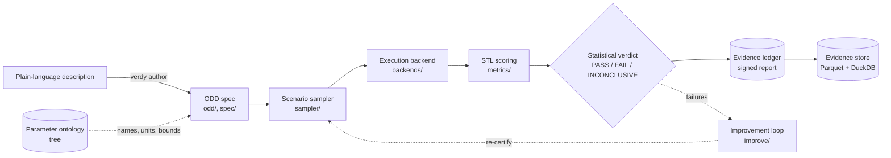

| Stage | What it does |
| --- | --- |
| **ODD spec** | A typed, versioned description of the *Operational Design Domain*: the conditions the robot must handle, how often each occurs, and which combinations are impossible. |
| **Scenario sampler** | Draws concrete scenarios from the ODD: stratified coverage, log replay, or failure-seeking importance sampling. |
| **Execution backend** | Runs the policy in each scenario and records a time-stamped trace of signals. |
| **STL scoring** | Scores every trace against Signal Temporal Logic safety specs (via [RTAMT](https://github.com/nickovic/rtamt)), as robustness margins rather than just pass/fail. |
| **Statistical verdict** | Turns the runs into a failure-probability estimate with confidence bounds, measures ODD coverage, and decides `PASS`, `FAIL` or `INCONCLUSIVE`. |
| **Evidence ledger** | Writes a report with every input, run and result, sealed with a digest and optionally signed. |

---

## Quick start

**Requirements:** Python 3.10, 3.11 or 3.12.

```bash
git clone https://github.com/DTInfinityAI/Verdy.git
cd Verdy
python -m venv .venv
source .venv/bin/activate        # Windows: .venv\Scripts\activate
pip install -e .

cd examples/home_robot
verdy run run_tuned.yaml
```

Optional extras: `pip install -e ".[llm]"` for Claude features (ODD drafting, SceneSmith
scene prompts), `".[laya]"` for the local Laya ontology resolver (no API key),
`".[sign]"` for Ed25519 report signatures, `".[store]"` for the evidence store and
history, and `".[dev]"` for tests and linting.

---

## Example

[`examples/home_robot`](examples/home_robot) tests a home robot that drives across a kitchen
while a person walks across its path, on Verdy's built-in simulator. The ODD varies
lighting, floor type, walking speed and timing, route length, speed limit, sensor range
and frame dropouts. Three safety specs:

```yaml
specs:
  - name: no_collision
    severity: critical
    formula: always(dist_obstacle >= 0.0)
  - name: slow_near_person
    severity: major
    formula: always((dist_obstacle <= 0.5) implies (speed <= 0.3))
  - name: reach_goal
    severity: minor
    formula: eventually[0:20](dist_goal <= 0.2)
```

Target: at most 5% of runs violate a critical or major spec, with 95% confidence.

```console
$ verdy run run_tuned.yaml
Verdict: PASS
  - failure probability is at most 0.03819 (<= 0.05) with 95% confidence
Runs: 1000 (28 failed, 0 errors)
Failure probability: 0.028 [0.01997, 0.03819] at 95% (clopper-pearson)
ODD coverage: 95%, pairwise 89%
Per spec:
  no_collision                 8 violations  p=0.008 (upper 0.01439)
  slow_near_person            25 violations  p=0.025 (upper 0.03474)
  reach_goal                   2 violations  p=0.002 (upper 0.006282)
Report digest: 0acc9e2b...
```

| Config | Policy tuning | Verdict |
| --- | --- | --- |
| `run.yaml` | Baseline | `FAIL`: 10.1% of runs fail, lower bound 8.6% |
| `run_tuned.yaml` | Slower, earlier braking | `PASS`: 2.8% fail, upper bound 3.8% |
| `run_collisions.yaml` | Collisions only, target ≤ 1%, importance sampling | `INCONCLUSIVE`: more runs needed |

---

## Key features

| Feature | Description |
| --- | --- |
| **ODD specs** | Typed, versioned [schema](docs/odd-spec.md) with distributions, constraints, simulator and runtime grounding, and provenance. LLM-assisted authoring with Claude, resolved against a shared [parameter ontology](docs/ontology.md) by a plug-in resolver (`exact`, local [Laya](https://github.com/NandhaKishorM/laya), or `llm`), with the decision, probability and human approval tracked per parameter. |
| **Scenario sampling** | Stratified (Latin hypercube) coverage, log replay, and cross-entropy importance sampling with likelihood-ratio weights. |
| **Backend-agnostic** | Built-in 2D simulator, log replay, SceneSmith-generated scenes, and a two-function adapter for custom simulators and hardware-in-the-loop rigs. |
| **SceneSmith integration** | A scene generated by [SceneSmith](https://github.com/nepfaff/scenesmith) for every scenario, from prompts written by Claude, with task success judged by SceneSmith's validator. Scenes are cached and reused. |
| **STL scoring** | Robustness margins per spec, not just pass/fail. |
| **Statistical verdicts** | Exact Clopper-Pearson bounds (weighted bounds for importance sampling), per-spec estimates, and per-parameter and pairwise coverage reports. |
| **Evidence ledger** | Every input, run and result in one report with a SHA-256 digest; HMAC or Ed25519 signatures. |
| **Runtime monitors** | The same specs, evaluated online on the robot with past-time STL. |
| **Improvement loop** | Test, find weaknesses, train on them, re-certify. Plug in any RL or RLHF trainer: a Python class or an external command. |
| **Human feedback (RLHF)** | Operators compare pairs of runs; a reward model learns what they value. Expert sessions pretrain the policy. |
| **Evidence store and history** | Traces as content-addressed Parquet, a DuckDB index rebuilt from signed reports, and `verdy history` to track verdicts and catch regressions across policy releases. |
| **Safe credentials** | API keys come from environment variables or a private secrets file, never configs. Reports store only hashed fingerprints, and logs, errors and reports are redacted. Subprocesses get only the keys they need. |

---

## Drafting an ODD

`verdy author` drafts an ODD from a plain-language description. Claude extracts candidate
parameters and an embedder shortlists matching entries from the
[parameter ontology](docs/ontology.md). A resolver picks the matching entry, and Claude
writes only the parameters the ontology doesn't have yet.

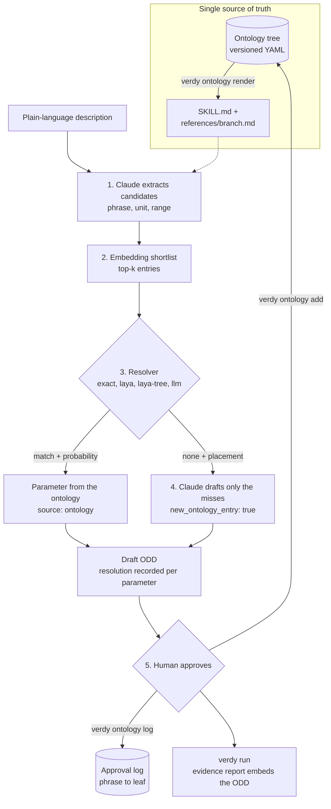

### One source of truth: the ontology tree

The ontology is a versioned YAML tree. Every node has an id, a label, a one-line definition,
aliases, a parent and a status (`draft` or `approved`). Leaves are ODD parameters, with
units, physical bounds, a distribution and grounding (the simulator parameter and runtime
signal they map to). An example path is `environment → water → water_optical → turbidity`.
Everything else is generated from this tree:

```bash
verdy ontology validate core                      # structure; at most 15 children per node
verdy ontology render core -o skills/ontology-core  # SKILL.md + references/<branch>.md
verdy ontology list core                          # print the tree
```

- **The rendered skill** gives the LLM the naming conventions, unit rules, top-level
  branches and worked examples (`SKILL.md`), plus one reference file per branch, loaded
  only when extraction touches that branch. Nobody edits it by hand, and CI fails if it is
  stale. Its digest is recorded in each drafted ODD, so the evidence report pins what the
  LLM was told. See [`skills/ontology-core/`](skills/ontology-core/SKILL.md).
- **The 15-children rule** leaves room for "none" within Laya's option budget. When a node
  outgrows it, `verdy ontology regroup` has Claude propose intermediate groups. They are
  written as `status: draft` for a human to approve.

### Regrouping a crowded node

Say `water` in your ontology has grown to 17 children. `validate` fails, and `regroup`
asks Claude for intermediate groups (`pip install -e ".[llm]"`, uses the
`ANTHROPIC_API_KEY` secret):

```console
$ verdy ontology validate subsea.yaml
subsea.yaml: error: water: 17 children, limit 15; add an intermediate group so Laya keeps
room for 'none' among its options (verdy ontology regroup proposes some)
$ verdy ontology regroup subsea.yaml water -o subsea.regrouped.yaml
water: 3 new draft groups (5 children now)
  + water_optical (Optical): turbidity, light_attenuation, secchi_depth, colour, ...
  + water_motion (Motion): current_speed, wave_height, swell_period, surge, ...
  + water_chemistry (Chemistry): salinity, dissolved_oxygen, ph
  why: separates how light, movement and composition of the water affect the robot
Wrote subsea.regrouped.yaml. Review the groups marked status: draft, then set status:
approved (or edit them), and re-render the skill.
```

(Illustrative output: the groups Claude proposes depend on your ontology.)

Verdy checks the proposal and sends any problems back to Claude to fix:
- a taken or invalid id;
- a child in two groups;
- a group with fewer than 2 or more than 15 children;
- the node still over the limit.

The output file has the new groups with their members moved under them:

```yaml
- id: water_optical
  parent: water
  label: Optical
  definition: How well light travels through the water.
  status: draft            # set to approved after review
- id: turbidity
  parent: water_optical    # was: water
  ...
```

Review the diff, then approve the groups and re-render the skill:

```bash
verdy ontology validate subsea.regrouped.yaml      # lists the draft groups until approved
verdy ontology render subsea.regrouped.yaml -o .claude/skills/ontology-subsea
```

Leave out the node name to regroup every node over the limit. Omit `-o` to update the
file in place. The approval log is unaffected: it stores phrase → leaf, so Laya's training
data is simply rebuilt from the new tree.

### Shortlisting with sentence-transformers

The default `hashing` embedder only matches shared words. To match paraphrases, use a
local [sentence-transformers](https://www.sbert.net/) model instead:

```bash
pip install -e ".[llm]" sentence-transformers
verdy author "ROV inspection in murky water near the jacket legs, with a strong current" \
  --embedder sentence-transformers:all-MiniLM-L6-v2 --top-k 20 -o odd.draft.yaml
```

Omit `:MODEL` to use the default `all-MiniLM-L6-v2`. The model runs locally and needs no
API key; it downloads from Hugging Face on first use. Add `--resolver laya` (with
`pip install -e ".[laya]"`) to resolve the shortlist with Laya locally too. From Python:

```python
from verdy.odd.authoring import draft_odd

odd = draft_odd(description, ontology="core", resolver="laya",
                embedder="sentence-transformers:all-MiniLM-L6-v2", top_k=20)
```

### Resolving with Laya

[Laya](https://github.com/NandhaKishorM/laya) is an open-weight decision model that runs
locally, with no API key. For each candidate it answers one multiple-choice question
whose options are the shortlisted entries plus `none`, and it returns a probability.
Install it, then pass `--resolver laya`:

```bash
pip install -e ".[llm,laya]"      # Laya pulls in PyTorch; weights download on first use
verdy author "ROV inspection in murky water near the jacket legs, with a strong current" \
  --resolver laya --min-probability 0.6 -o odd.draft.yaml
```

The output looks like this (probabilities come from the model and will differ):

```text
Draft ODD with 3 parameters written to odd.draft.yaml.
Resolved against core@0.2.0 with the laya resolver: 2 matched, 1 new.
  'murky water'                    -> turbidity  (p=0.93)
  'strong current'                 -> current_speed  (p=0.88)
  'jacket legs'                    -> jacket_leg_spacing  NEW ONTOLOGY ENTRY (p=0.81)
Review every parameter, then set provenance.approved: true on the ones you accept.
```

A match below `--min-probability` (default 0.5) counts as `none`, so Claude writes a new
entry for it and records the rejected choice as `proposed`. To pin a Laya checkpoint
instead of letting Laya's router pick one, add `--resolver-option checkpoint=multilingual`
(or `english`). From Python:

```python
from verdy.odd.authoring import draft_odd
from verdy.odd.resolve import LayaResolver

odd = draft_odd(description, ontology="core",
                resolver=LayaResolver(min_probability=0.6, checkpoint="english"))
print(odd["turbidity"].provenance["resolution"])
# {'resolver': 'laya', 'model': 'laya:english', 'decision': 'turbidity',
#  'probability': 0.93, 'candidate': 'water_clarity', 'phrase': 'murky water', ...}
```

Each parameter records the embedder, its shortlist and the resolver's decision in its
provenance. Review the draft and set `provenance.approved: true` on what you accept. Once
approved, `verdy ontology add odd.draft.yaml --ontology core -o my-ontology.yaml` copies
the new entries into your own ontology, so the next ODD resolves them with no LLM
authoring.

### Walking the tree with Laya

`--resolver laya-tree` has Laya descend the ontology tree instead of choosing from a flat
shortlist. At each level, it picks among the node's children (each shown as a gloss of
about ten words) or "none":

- **Beam, not greedy.** When the top two branches are close, both are kept, so one early
  mistake doesn't send the match down the wrong subtree. The final probability is the
  product along the path.
- **"None" is informative.** `water → water_optical`, then "none", means a new entry is
  needed, and it belongs under `water_optical`. That placement goes to Claude, which drafts
  the entry in the right place.

#### Example

With a checkpoint fine-tuned on your approvals (see the next section):

```console
$ verdy author "ROV inspection in murky water near the jacket legs, with a strong current" \
    --resolver laya-tree --resolver-option checkpoint=./laya_verdy -o odd.draft.yaml
Draft ODD with 3 parameters written to odd.draft.yaml.
Resolved against core@0.2.0 with the laya-tree resolver: 2 matched, 1 new.
  'murky water'                    -> turbidity  (p=0.82)
  'strong current'                 -> current_speed  (p=0.77)
  'near the jacket legs'           -> jacket_leg_clearance  NEW ONTOLOGY ENTRY (p=0.50)
Review every parameter, then set provenance.approved: true on the ones you accept.
```

(Illustrative output: the probabilities come from your checkpoint.)

This is how "murky water" was resolved. One Laya question is asked per level, each over
that node's children plus "none":

| Level | Options | Chosen | p | Path p |
| --- | --- | --- | --- | --- |
| 1 | environment, platform, task, sensors, faults, none | `environment` | 0.97 | 0.97 |
| 2 | light, weather, water, terrain, space, people, none | `water` | 0.95 | 0.92 |
| 3 | water_optical, water_motion, water_site, none | `water_optical` | 0.93 | 0.86 |
| 4 | turbidity, none | `turbidity` | 0.96 | **0.82** |

"Near the jacket legs" went `task` (0.62), then "none" (0.81): no task parameter fits. Claude
drafts `jacket_leg_clearance` under `task` and records it as `ontology_parent: task`, so
`verdy ontology add` files it there after approval.

**The beam at work.** For an ambiguous phrase such as "2 m visibility", level 1 might give
`environment` 0.52 and `sensors` 0.41. Those are within `beam_margin` (0.2) of each other,
so both branches are walked:
- `environment → weather → fog_visibility` ends at 0.52 × 0.9 × 0.88 = 0.41;
- `sensors → perception → sensor_range` ends at 0.41 × 0.95 × 0.9 = 0.35.

The more probable complete path wins, rather than whichever branch looked best first. Both
values are under the default `--min-probability` of 0.5, so the best guess,
`fog_visibility`, is recorded as `proposed` and the phrase is treated as a new entry for a
human to look at. Lower the threshold to accept it.

Each parameter records the walk in its provenance, and evidence reports embed it:

```yaml
provenance:
  source: ontology
  confidence: 0.82
  approved: false
  resolution:
    resolver: laya-tree
    model: laya:./laya_verdy
    decision: turbidity
    probability: 0.82
    candidate: water_clarity
    phrase: murky water
    path:
      - {node: environment, p: 0.97}
      - {node: water, p: 0.95}
      - {node: water_optical, p: 0.93}
      - {node: turbidity, p: 0.96}
    ontology: core@0.2.0
```

Tune the walk with `--resolver-option beam_width=3 --resolver-option beam_margin=0.1`.
From Python:

```python
from verdy.odd.authoring import draft_odd
from verdy.odd.resolve import LayaTreeResolver

odd = draft_odd(description, ontology="my-ontology.yaml",
                resolver=LayaTreeResolver(checkpoint="./laya_verdy", beam_width=2,
                                          beam_margin=0.2, min_probability=0.5))
print(odd["turbidity"].provenance["resolution"]["path"])
```

### Training Laya on your approvals

The base Laya checkpoints are a fast base to specialise, not a zero-shot decision engine.
The walker earns its place once it is fine-tuned on your approval history. Start logging
approvals today, whatever resolver you use:

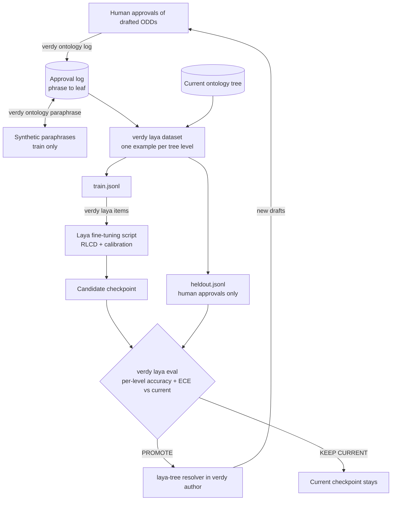

`verdy laya due` tells a scheduled job when enough new approvals have arrived to go round
the loop again (every few hundred).

#### Example: a first fine-tuning round

A team has logged 310 human approvals and wants to know whether a fine-tuned walker beats
the base checkpoint. (Illustrative output: counts and scores depend on your data.)

```console
# 1. Log each approved ODD (verdy ontology add also does this)
$ verdy ontology log rov-inspection.yaml --ontology subsea.yaml
Logged 6 new approvals to .verdy/ontology/approvals.jsonl (0 already logged)

# 2. Optional: synthetic paraphrases ("poor vis", "silty"), used for training only
$ verdy ontology paraphrase -n 3
Added 412 synthetic paraphrases to .verdy/ontology/approvals.jsonl (tagged source: synthetic; held-out evaluation uses human approvals only)

# 3. One example per tree level, from the current tree
$ verdy laya dataset --ontology subsea.yaml -o laya_data --holdout 0.2
Wrote laya_data: 1840 training rows, 402 held-out rows from 310 human and 412 synthetic approvals (subsea@0.3.0).

# 4. Base checkpoint, then tokenize for Laya's fine-tuning script
$ huggingface-cli download convaiinnovations/laya --local-dir laya_base
$ verdy laya items laya_data/train.jsonl --model-dir laya_base -o laya_data/train_items.pt
Wrote 1840 training items to laya_data/train_items.pt (0 skipped).

# 5. Train with Laya's own script (Apple Silicon or CPU; Kaggle 2xT4 notebook for CUDA)
$ python laya_finetune_typed_decisions_mps.py --model-dir laya_base \
    --items laya_data/train_items.pt --output-dir laya_verdy \
    --epochs 4 --micro-batch 1 --grad-accum 32
Using legacy cached training items without metadata: laya_data/train_items.pt
Device: mps
Training items: 1656; calibration items: 184
Epoch 1/4 complete; avg_loss=0.8123
...
Epoch 4/4 complete; avg_loss=0.2147
Running temperature calibration ...
Model saved to laya_verdy
Temperatures: [1.08, 1.2, 1.2]

# 6. Promote only if it beats the current checkpoint on held-out human approvals
$ verdy laya eval laya_data/heldout.jsonl --checkpoint ./laya_verdy --baseline english \
    -o laya_verdy.eval.json
./laya_verdy: accuracy 0.912, ECE 0.031, Brier 0.071 (n=402)
  level 1: accuracy 0.976, ECE 0.018 (n=124)
  level 2: accuracy 0.927, ECE 0.029 (n=124)
  level 3: accuracy 0.871, ECE 0.044 (n=104)
  level 4: accuracy 0.78, ECE 0.051 (n=50)
  match   accuracy 0.93 (n=348)
  none    accuracy 0.796 (n=54)
english: accuracy 0.41, ECE 0.22, Brier 0.48 (n=402)
  ...
PROMOTE ./laya_verdy vs english:
  accuracy 0.410 -> 0.912
  ECE 0.220 -> 0.031

# 7. Use it, keep logging, and retrain when enough new approvals arrive
$ cp -r laya_verdy laya_checkpoints/2026-10-03
$ verdy author "$(cat rov-site-b.txt)" --ontology subsea.yaml --resolver laya-tree \
    --resolver-option checkpoint=laya_checkpoints/2026-10-03 -o site-b.draft.yaml
$ verdy laya due --manifest laya_data/manifest.json --every 300
362 human approvals, 310 in the last dataset, 52 new: retraining is not due (every 300).
```

At the next round, compare against the promoted checkpoint rather than `english`:
`--baseline laya_checkpoints/2026-10-03`. `verdy laya eval` exits 0 only on `PROMOTE`, so
a scheduled job can chain the steps and promote automatically.

How the data is built:
- One approval gives one training example per level, with siblings as hard negatives.
- Approved new entries give the "none" examples, over a snapshot of the options shown at
  the time.
- Restructuring the tree never invalidates the log, because examples are regenerated from
  the current tree.

When to switch: under ~100 entries for one customer, embeddings plus the LLM are enough.
Fine-tuned Laya pays off with hundreds of entries, many domain packs, offline sites or
audit requirements. For the first few hundred approvals, resolve with `--resolver llm`,
log everything, and switch to `laya-tree` once it beats the LLM on held-out approvals.

The full walkthrough covers hardware, the training script, the promotion rules and
scheduling: [docs/laya-finetuning.md](docs/laya-finetuning.md).

---

## Scenario sampling

A sampler turns the ODD into concrete scenarios. Every sampler is deterministic given its
seed, and every scenario satisfies the ODD's constraints. Pick one by what you need from
the runs:

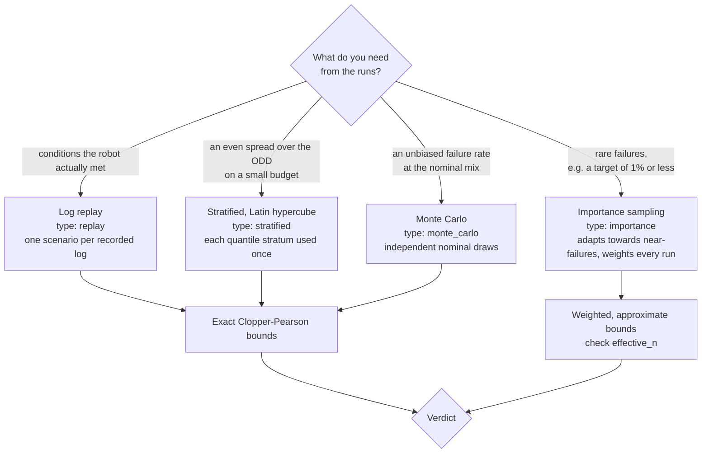

```bash
verdy sample odd.yaml -n 10 --sampler stratified     # preview scenarios
```

Importance sampling refits its proposal after every batch from the runs that came closest
to failing, and weights each run so the failure rate is still estimated under the nominal
ODD. Details: [docs/sampling.md](docs/sampling.md).

---

## STL scoring

Every run is scored against Signal Temporal Logic specs with
[RTAMT](https://github.com/nickovic/rtamt). Each spec gets a **robustness**: a signed margin
by which the trace satisfied it (positive) or violated it (negative). For example,
`speed <= 0.3` has robustness `0.3 - speed`, `always` takes the minimum over time and
`eventually` the maximum.

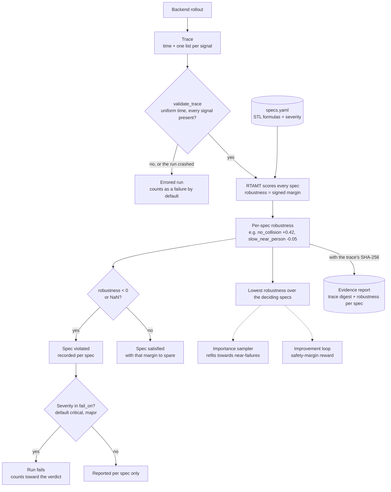

```yaml
specs:
  - name: no_collision
    severity: critical
    formula: always(dist_obstacle >= 0.0)
  - name: slow_near_person
    severity: major
    formula: always((dist_obstacle <= 0.5) implies (speed <= 0.3))
```

Guide: [docs/stl-specs.md](docs/stl-specs.md).

---

## Verdicts

Set the highest acceptable failure probability and a confidence level. From the runs,
Verdy computes one-sided bounds `L` and `U` on the failure probability:

| Verdict | Condition | Meaning |
| --- | --- | --- |
| `PASS` | `U ≤ max_failure_prob`, coverage met | Fails at most that often, with the stated confidence. |
| `FAIL` | `L > max_failure_prob` | Fails more often than allowed, with the stated confidence. |
| `INCONCLUSIVE` | otherwise | Not enough evidence yet: run more scenarios or cover more of the ODD. |

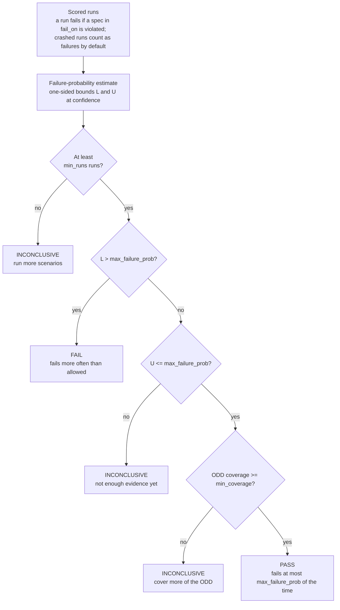

Details, assumptions and limits: [docs/verdicts.md](docs/verdicts.md).

---

## Runtime monitors

The specs a policy is certified against also run on the robot, flagging violations as they
happen:

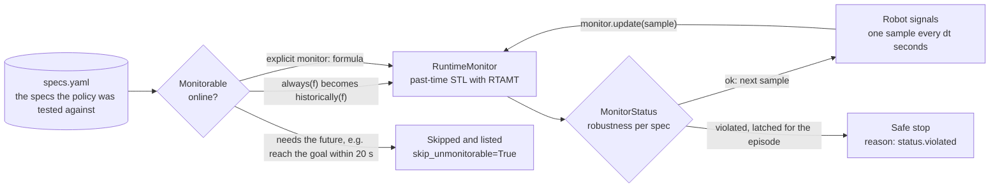

```python
from verdy.metrics import load_specs
from verdy.monitor import RuntimeMonitor

monitor = RuntimeMonitor(load_specs("specs.yaml"), dt=0.1, skip_unmonitorable=True)
for sample in robot_stream():                 # e.g. {"dist_obstacle": 0.8, "speed": 0.4}
    status = monitor.update(sample)
    if not status.ok:
        robot.safe_stop(reason=status.violated)
```

A monitor can't see the future, so it uses past-time formulas: `always(...)` specs are
converted to `historically(...)` automatically, other specs need an explicit `monitor`
formula, and specs that need the future are skipped. A violation latches for the episode,
so create a new monitor per episode. Guide: [docs/runtime-monitors.md](docs/runtime-monitors.md).

---

## Improvement loop

Every Verdy test shows where a policy is fragile, by how much it nearly failed, and under
which conditions. `verdy improve` turns that into a closed loop: **test, find
weaknesses, train on them, re-certify.**

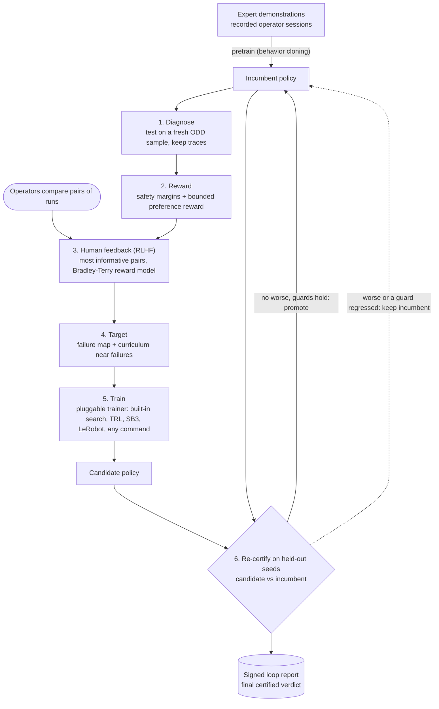

| What it does | How |
| --- | --- |
| **Safety margins as rewards** | STL robustness becomes a reward that keeps paying until a run clears each spec by a margin, so the policy learns to keep its distance from failure instead of scraping a pass. |
| **Targeted practice** | A failure map shows which conditions fail most, and a curriculum draws most training scenarios near observed failures. |
| **Human feedback (RLHF)** | Operators compare pairs of runs and pick the better one (smoother, safer, more like an expert). A Bradley-Terry reward model learns what they value, bounded so it can never outweigh safety. |
| **Learning from experts** | Recorded operator sessions pretrain the policy (behavior cloning) before feedback-driven training. |
| **Proven, not assumed** | Every candidate and the current policy are certified on fresh scenarios from a separate seed stream that training never sees. The candidate is promoted only if it is no worse and does not regress guarded specs, such as task completion. |

Every part is **plug and play**:

| Module | Built in | Bring your own |
| --- | --- | --- |
| Trainer (the RL/RLHF algorithm) | `parameter_search` (cross-entropy search, with behavior-cloning pretraining) | Any Python class with `train(policy, data, ctx)`, or **any external command** (TRL, Stable-Baselines3, LeRobot, a GPU job) that reads Verdy's exported data |
| Feedback source | `file` (operators label `pending.jsonl`), `cli`, `scripted` | Any class with `label(pairs)` (a web app, a labeling service) |
| Reward model | Bradley-Terry over run features | Any class with `fit`, `predict` |
| Curriculum | Failure-focused cross-entropy sampler | Any class with `fit`, `sample` |

```bash
cd examples/home_robot
verdy improve improve.yaml
```

```text
Starting policy: FAIL  p_fail=0.114 [0.09783, 0.1319]
After pretraining on demonstrations: INCONCLUSIVE  p_fail=0.062 [0.04993, 0.07603]
Cycle 1: candidate INCONCLUSIVE  p_fail=0.043 ... -> promoted (failure probability on held-out scenarios is no worse)
Cycle 2: candidate PASS  p_fail=0.029 ... -> kept incumbent (reach_goal regressed from 0.001 to 0.013 (tolerance 0.01))
Cycle 3: candidate PASS  p_fail=0.011 ... -> promoted (verdict improved to PASS)
Final certified policy: PASS  p_fail=0.011 (upper 0.01814)
  per-spec violation rates: no_collision 0.003, slow_near_person 0.01, reach_goal 0.007
```

The demo's operator is simulated so it runs anywhere. With real operators, switch to
the file labeler and record real sessions. The full guide is
[docs/improvement-loop.md](docs/improvement-loop.md).

---

## SceneSmith setup

[SceneSmith](https://github.com/nepfaff/scenesmith) generates simulation-ready indoor
scenes (Drake model directives) from text prompts. Verdy can generate a scene for every
sampled scenario, run your policy in it, and have SceneSmith's validator judge the task.

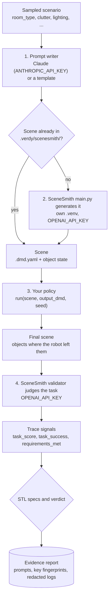

Verdy and SceneSmith run in separate Python environments. Keys come from environment
variables or a private secrets file, each SceneSmith subprocess gets only the keys listed
for it, and its output is redacted before it is logged. The steps below set this up.

**1. Install SceneSmith** (Linux with an NVIDIA GPU; SceneSmith pins Python 3.11 and its
own dependencies, separate from Verdy's):

```bash
git clone https://github.com/nepfaff/scenesmith ~/scenesmith
cd ~/scenesmith
curl -LsSf https://astral.sh/uv/install.sh | sh     # if uv is not installed
uv sync                                             # creates ~/scenesmith/.venv
sudo apt-get install bubblewrap                     # for SceneSmith's multi-GPU rendering
```

Follow SceneSmith's README for its asset and retrieval servers, and check it works on
its own first: `.venv/bin/python main.py +name=smoke_test`.

**2. Install Verdy with Claude support** (in Verdy's own environment):

```bash
cd ~/Verdy && pip install -e ".[llm]"
```

**3. Set your API keys** as environment variables, or in a private secrets file. Never put
them in a config file; Verdy rejects configs that contain keys.

```bash
mkdir -p ~/.config/verdy
$EDITOR ~/.config/verdy/secrets.env      # OPENAI_API_KEY=...  ANTHROPIC_API_KEY=...
chmod 600 ~/.config/verdy/secrets.env
verdy secrets status                     # shows which keys are set, as fingerprints only
```

| Secret | Why |
| --- | --- |
| `OPENAI_API_KEY` | SceneSmith's own agents (scene generation and task validation) use OpenAI |
| `ANTHROPIC_API_KEY` | Claude writes a scene prompt for each scenario |
| `GOOGLE_API_KEY` | Optional: SceneSmith's Gemini image backend |
| `VERDY_FINGERPRINT_KEY` | Optional: keyed (`hmac`) key fingerprints in reports |

**4. Point Verdy at SceneSmith**, in the run config (or `export SCENESMITH_DIR=~/scenesmith`):

```yaml
backend:
  type: scenesmith
  options:
    task: Find the target object and place it on the main table or desk in the room.
    scenesmith_dir: ~/scenesmith
    prompt: {writer: claude}               # or {writer: template, template: "A {room_type} ..."}
    secrets: [OPENAI_API_KEY]              # names only
    extra_env: {WANDB_MODE: disabled}
```

**5. Wrap your robot policy.** It receives the generated scene and writes the final scene
with objects where the robot left them (SceneSmith's robot-evaluation contract):

```python
class MyRobotPolicy:
    def run(self, scene, output_dmd, seed):
        # scene.dmd: initial .dmd.yaml   scene.state: object metadata   scene.task: the task
        final_poses = run_robot_in_drake(scene, seed)
        write_dmd_with_poses(scene.dmd, final_poses, output_dmd)
```

**6. Run it:**

```bash
cd examples/scenesmith
verdy validate odd.yaml specs.yaml
verdy run run.yaml                       # starts with the DoNothingPolicy baseline
```

Each scene takes minutes to generate, so start with a few runs. Scenes are cached in
`.verdy/scenesmith/` and reused on reruns. Logs there are redacted of keys. For details
(prompt writers, signals, options, costs) see
[docs/backends.md](docs/backends.md#scenesmith). The integration is tested against a
stand-in SceneSmith checkout; report anything that differs on a real installation.

---

## Evidence store and history

Signed reports stay the source of truth. With `pip install -e ".[store]"`, Verdy also keeps
every run's trace as Parquet in a content-addressed store, addressed by the hash the
report already records and batched many traces per file (3,000 runs: 3 files, 7.5 MB),
and builds a local DuckDB index from reports that can always be rebuilt from them. That makes questions across releases one command:

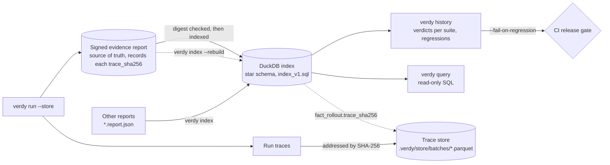

```bash
cd examples/home_robot
verdy run run.yaml --store          # home-navigator 1.0.0
verdy run run_tuned.yaml --store    # 1.1.0
verdy run run_v1_2.yaml --store     # 1.2.0, a "faster" retune
verdy history home-navigator --by-spec
```

```text
Policy home-navigator
  Suite: home-robot-kitchen-crossing 0.1.0 | 3 specs, critical+major | p <= 0.05 @ 0.95
  version        date                verdict        p_fail              bounds   runs     no_collision       reach_goal slow_near_person
  1.0.0          2026-10-02 14:40:18 FAIL           10.10%     [8.57%, 11.81%]   1000            2.00%            0.00%           10.10%
  1.1.0          2026-10-02 14:40:26 PASS            2.80%      [2.00%, 3.82%]   1000            0.80%            0.20%            2.50%
  1.2.0          2026-10-02 14:40:33 INCONCLUSIVE    5.00%      [3.92%, 6.29%]   1000            1.20%            0.00%            4.90%
                 ^ REGRESSION: verdict PASS -> INCONCLUSIVE (vs 1.1.0)
```

History compares only verdicts from the same test suite (same ODD, specs and verdict
rule), and flags a regression when the verdict drops or the failure rate is significantly
higher. Add `--fail-on-regression` to gate a release in CI. The index is a star schema
(dimensions: ODD, policy version, spec, backend, scenario; facts: verdicts, rollouts,
per-spec robustness, feedback), versioned in `verdy/spec/index_v1.sql`. Query it with
`verdy query "SELECT ..."`. Guide: [docs/evidence-store.md](docs/evidence-store.md).

---

## Command line

| Command | Purpose |
| --- | --- |
| `verdy validate odd.yaml specs.yaml` | Validate ODD and spec files |
| `verdy sample odd.yaml -n 10` | Preview sampled scenarios |
| `verdy run run.yaml [--sign hmac]` | Run an evaluation and write the evidence report |
| `verdy verify report.json` | Check a report's digest and signature |
| `verdy plan --max-failure-prob 0.01` | Runs needed to demonstrate a target |
| `verdy author "description" [--resolver laya]` | Draft an ODD: Claude extracts, the ontology resolver matches, Claude writes only new entries |
| `verdy ontology list` / `validate` / `render` | Show the ontology tree / check it (15 children per node) / render its LLM skill |
| `verdy ontology regroup ontology.yaml -o out.yaml` | Claude proposes intermediate groups for nodes over 15 children, as drafts for a human to approve |
| `verdy ontology log` / `add` / `paraphrase` | Log approvals as phrase → leaf / also add approved new entries / add synthetic paraphrases |
| `verdy laya dataset` / `items` / `eval` / `due` | Fine-tune the Laya tree walker: export data, tokenize, gate promotion, schedule retraining |
| `verdy improve improve.yaml` | Run the closed improvement loop: test, train, re-certify |
| `verdy run run.yaml --store` | Also keep traces as Parquet and index the report |
| `verdy history home-navigator` | Verdicts across policy versions, with regressions flagged |
| `verdy index` / `verdy query "SQL"` | Index reports / query the evidence index |
| `verdy secrets status` | Which API keys are set, as fingerprints (never values) |
| `verdy secrets scan .` | Check files for committed credentials |
| `verdy schema odd` | Print the ODD JSON Schema |

`verdy run` (and `verdy improve`, for the final certified policy) exits with 0 for `PASS`,
1 for `FAIL` and 3 for `INCONCLUSIVE`, so it can gate a CI or training pipeline. See [docs/cli.md](docs/cli.md).

---

## API keys

Set keys as environment variables, or in `~/.config/verdy/secrets.env` (`chmod 600`), and
check them with `verdy secrets status`:

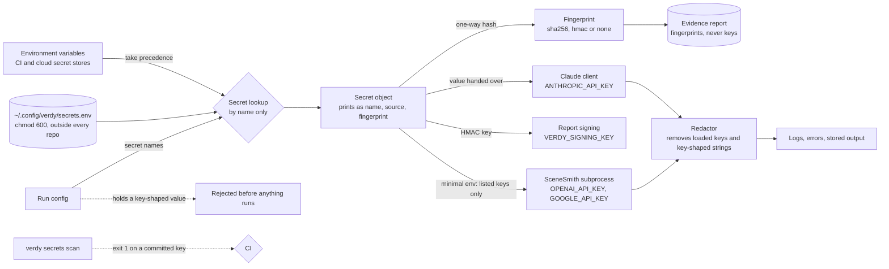

| Secret | Used for |
| --- | --- |
| `ANTHROPIC_API_KEY` | Claude: ODD drafting and SceneSmith scene prompts |
| `OPENAI_API_KEY` | SceneSmith's generation and validation agents |
| `VERDY_SIGNING_KEY` | HMAC report signatures |
| `VERDY_FINGERPRINT_KEY` | Keyed fingerprints of the other keys in reports |

Never put keys in run configs: Verdy rejects a config that contains one. Reports record
each key as a fingerprint (`sha256`, `hmac` or `none`, set by `credentials.fingerprint`),
and everything Verdy prints, logs or stores is redacted. Details:
[docs/secrets.md](docs/secrets.md).

---

## Documentation

| Guide | |
| --- | --- |
| [Getting started](docs/getting-started.md) | Install, run the example, evaluate your own policy |
| [ODD specification](docs/odd-spec.md) | The ODD document format |
| [Ontology and resolvers](docs/ontology.md) | The ontology tree, the rendered skill, LLM → shortlist → resolver (`exact`, Laya, `laya-tree`, `llm`) → LLM authoring, the approval log |
| [Laya fine-tuning](docs/laya-finetuning.md) | Training the Laya tree walker on your approvals, evaluating it per level, promoting it |
| [Safety specs (STL)](docs/stl-specs.md) | Writing requirements and how robustness works |
| [Scenario sampling](docs/sampling.md) | Samplers and when to use them |
| [Execution backends](docs/backends.md) | Simulators, log replay, SceneSmith, HIL |
| [Verdicts and statistics](docs/verdicts.md) | The decision rule, bounds and coverage |
| [Evidence ledger](docs/evidence-ledger.md) | Reports, digests, signatures, reproducibility |
| [Runtime monitors](docs/runtime-monitors.md) | Running specs on the robot |
| [Improvement loop](docs/improvement-loop.md) | Rewards, RLHF, demonstrations, trainers, re-certification |
| [Evidence store and history](docs/evidence-store.md) | Parquet traces, the DuckDB index, history and regressions |
| [Credentials and API keys](docs/secrets.md) | Setting keys safely, fingerprints, leak scanning |
| [Command-line reference](docs/cli.md) | Commands, options, exit codes, run configs |

---

## Project structure

```
Verdy/
├── pyproject.toml            # Package metadata, dependencies, tool settings
├── verdy/
│   ├── spec/                 # Versioned JSON Schemas (ODD, STL specs, ontology), core ontology
│   ├── odd/                  # ODD model, validation, authoring, ontology tree, skill, resolvers, approval log
│   ├── finetune/             # Laya training data, items, evaluation and promotion gate
│   ├── sampler/              # Monte Carlo, stratified, importance, replay samplers
│   ├── backends/             # Backend interface, sim2d, replay, SceneSmith, function adapter
│   ├── metrics/              # STL specs and robustness scoring (RTAMT)
│   ├── monitor/              # Runtime monitors
│   ├── verdict/              # Statistics, coverage, decision rule
│   ├── ledger/               # Hashing, evidence reports, signatures
│   ├── improve/              # Improvement loop: rewards, RLHF, curriculum, trainers
│   ├── store/                # Parquet trace store and DuckDB evidence index
│   ├── secrets.py            # API keys: lookup, fingerprints, redaction
│   ├── llm.py                # Claude client (key from secrets)
│   ├── harness.py            # The evaluation pipeline
│   ├── config.py             # Run-config loading
│   └── cli.py                # The `verdy` command
├── examples/
│   ├── home_robot/           # Full evaluation and improvement loop on the built-in simulator
│   ├── log_replay/           # Scoring recorded runs
│   └── scenesmith/           # Pick and place on SceneSmith-generated homes
├── skills/ontology-core/     # LLM skill rendered from the core ontology (generated)
├── docs/                     # Guides and the ODD specification
└── tests/                    # pytest suite
```

---

## Demo video script

A four-minute screen recording that shows Verdy end to end: describe the world, test a
policy, fix it, improve it automatically, and point at realistic scenes. Every command and
output below is real; re-recording produces the same numbers.

<details>
<summary><b>Show the script</b> (8 scenes, about 4 minutes)</summary>

### Before recording

- Install Verdy (`pip install -e .`) and `cd examples/home_robot`. Delete `reports/` for a
  clean start.
- Run `verdy improve improve.yaml -q` once beforehand. It takes about 1.5 minutes; record
  it live and speed it up in editing, or cut to the finished output.
- Use a large terminal font (18 pt or more) and a dark theme. Keep an editor open beside
  the terminal for the YAML files.
- Run `verdy secrets status` off camera first. If any key is set, its line shows a
  fingerprint, never the key, but check what will be on screen anyway.

### Scene 1: Cold open (0:00 to 0:15)

| On screen | Narration |
| --- | --- |
| Title card: **Verdy: a driving test for robot AI**. | "Would you let a robot drive through your kitchen without a driving test? Verdy is that test, for robot AI." |

### Scene 2: The problem (0:15 to 0:35)

| On screen | Narration |
| --- | --- |
| Diagram from [How it works](#how-it-works): ODD → sampler → backend → STL scoring → verdict → ledger. | "A robot policy that works in a demo can still fail in the conditions it will actually meet. Verdy samples those conditions, runs the policy in every one of them, scores each run against formal safety rules, and tells you whether it is safe to deploy, and how confident you can be." |

### Scene 3: Describe the world (0:35 to 1:00)

| On screen | Narration |
| --- | --- |
| `odd.yaml` in the editor: scroll past `lighting`, `floor_type`, `person_speed`, `sensor_dropout`. | "First, describe where the robot operates. This home robot crosses a kitchen while a person walks across its path. Lighting from dusk to daylight, five floor types including wet tile, people walking at different speeds, and sensor dropouts." |
| Terminal: `verdy validate odd.yaml specs.yaml` → `odd.yaml: OK (ODD with 8 parameters)`, `specs.yaml: OK (3 STL specs)`. Then `verdy sample odd.yaml -n 3`. | "Verdy checks the description, then turns it into concrete test scenarios. Each row is one situation the robot must handle." |

### Scene 4: The safety rules (1:00 to 1:20)

| On screen | Narration |
| --- | --- |
| `specs.yaml`: highlight `always(dist_obstacle >= 0.0)` and `always((dist_obstacle <= 0.5) implies (speed <= 0.3))`. | "Then write the safety rules in Signal Temporal Logic. Never touch the person. Within half a metre, slow to walking-aid speed. Reach the goal within twenty seconds. Verdy doesn't just score pass or fail: it measures by how much each rule was kept or broken." |

### Scene 5: Take the test (1:20 to 2:00)

| On screen | Narration |
| --- | --- |
| `verdy run run.yaml` | "Now the test: a thousand scenarios, in about five seconds." |
| Output: `Verdict: FAIL`, `Runs: 1000 (101 failed, 0 errors)`, `Failure probability: 0.101 [0.08571, 0.1181]`. Highlight the `slow_near_person 101 violations` line. | "Fail. About ten percent of runs break a rule. Mostly, the robot is still moving too fast near the person, and two percent of runs end in a collision. And this is not a hunch: with ninety-five percent confidence, the failure rate is above our five-percent limit." |

### Scene 6: Fix it and prove it (2:00 to 2:30)

| On screen | Narration |
| --- | --- |
| `run_tuned.yaml` beside `run.yaml`: `cruise: 0.8`, `slow_radius: 2.5`. Then `verdy run run_tuned.yaml`. | "Slow the cruise speed and brake earlier, then run the same test again." |
| Output: `Verdict: PASS`, `failure probability is at most 0.03819 (<= 0.05) with 95% confidence`. | "Pass. At most 3.8 percent failures, with ninety-five percent confidence." |
| `verdy verify reports/home_robot_tuned.report.json` → `digest OK, signature not checked; verdict PASS`. | "Every verdict comes with an evidence report: every input, every run, every score, sealed with a digest and optionally signed, so anyone can audit it." |

### Scene 7: From testing to improving (2:30 to 3:20)

| On screen | Narration |
| --- | --- |
| Loop diagram from [Improvement loop](#improvement-loop). | "Verdy doesn't stop at a verdict. Every test shows where the policy is fragile, and that becomes training signal." |
| `verdy improve improve.yaml` (sped up). Reveal the output line by line. | "Safety margins become rewards. Practice concentrates where the policy failed. Operators compare pairs of runs and pick the better one, and a reward model learns what they value. Recorded expert sessions give the policy a head start." |
| Highlight `Starting policy: FAIL p_fail=0.114` and `After pretraining on demonstrations: INCONCLUSIVE p_fail=0.062`. | "Learning from the expert's sessions alone nearly halves the failures." |
| Highlight cycle 2: `kept incumbent (reach_goal regressed ...)`. | "And every candidate is re-certified on scenarios it never trained on. This one was safer, but reached the goal less often, so Verdy kept the old policy. Improvement is proven, not assumed." |
| Highlight `Final certified policy: PASS p_fail=0.011 (upper 0.01814)`. | "Three cycles later: from eleven percent failures to one percent, certified." |
| Caption: "Demo: built-in 2D simulator, simulated operator." | "Here the operator is simulated so the demo runs anywhere. With your team, it's real people and real recordings." |

### Scene 8: Realistic scenes, and close (3:20 to 4:00)

| On screen | Narration |
| --- | --- |
| [SceneSmith setup](#scenesmith-setup) in the README and `examples/scenesmith/run.yaml`, highlighting `type: scenesmith` and `writer: claude`. | "For realistic homes, Verdy connects to SceneSmith. Claude writes a scene description for every test scenario, SceneSmith builds a simulation-ready scene from it, and its validator judges whether the robot finished the task." |
| `verdy secrets status`. | "Your API keys stay in environment variables or a private secrets file. Reports record only fingerprints, never the keys." |
| End card: **Verdy by DeepThought Infinity, DTI.ai** · github.com/DTInfinityAI/Verdy | "Test, find weaknesses, train, re-certify. Robots that get measurably safer every cycle. Verdy." |

</details>

---

## Project status

Verdy `0.7.0` is **alpha**: the pipeline works end to end and is tested, but APIs and file
formats may change before `1.0`. Known limitations:

- The built-in simulator is a teaching and testing tool. Results from it say nothing about
  a real robot.
- SceneSmith's own agents use OpenAI, so the SceneSmith backend needs `OPENAI_API_KEY`
  as well as your Claude key. The integration is tested against a stand-in SceneSmith
  checkout, not yet a full SceneSmith installation.
- Importance-sampling bounds are approximate. See [docs/sampling.md](docs/sampling.md).
- The improvement loop's built-in trainer tunes policy parameters; train neural policies
  by plugging in your RL framework (command or Python trainer).
- Python 3.13 is not supported until RTAMT's parser runtime supports it.

Built by **DeepThought Infinity (DTI.ai)**. Changes are listed in [CHANGELOG.md](CHANGELOG.md).

---

## Contributing

See [CONTRIBUTING.md](CONTRIBUTING.md). In short: `pip install -e ".[dev,sign]"`, then
`ruff check .` and `pytest` before opening a pull request.

---

## License

Verdy is licensed under the [Apache License 2.0](LICENSE).
