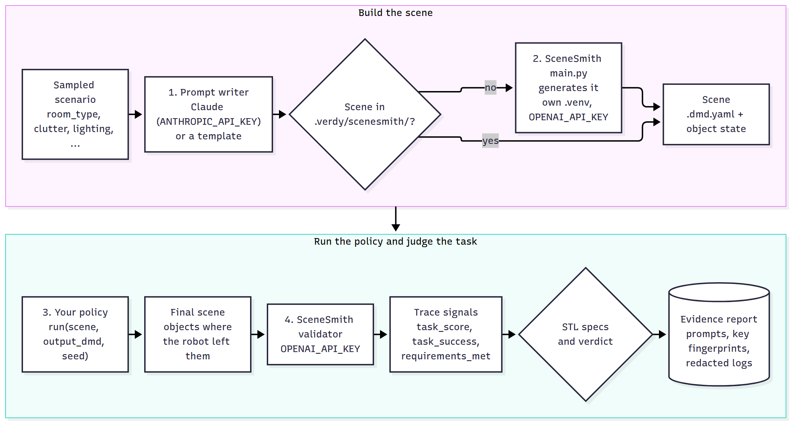

# Execution backends

A backend turns a scenario into a rollout. Every backend implements
`verdy.backends.Backend`:

| Method | Description |
| --- | --- |
| `build(scenario) -> env` | Realize a scenario (`{"id", "params", "seed", "metadata"}`) as a runnable environment. |
| `rollout(env, policy, seed) -> trace` | Run the policy and return a [trace](stl-specs.md#traces). |
| `bind(odd)` | Called once with the ODD before any rollout. Optional. |
| `close()` | Called once after the last rollout. Optional. |
| `config()` | Settings recorded in the report. Optional. |
| `describe(env)` | Per-run details recorded in the report (e.g. a scene prompt). Optional. |
| `secret_names()` | Secrets the backend uses; the report records their fingerprints. Optional. |

`self.sim_params(scenario)` returns the scenario parameters keyed by each parameter's
`grounding.sim` name, so ODD names and simulator names can differ.

| Backend | Config `type` | Purpose |
| --- | --- | --- |
| `HomeNavSim` | `sim2d` | Built-in 2D home-robot simulator, for demos and tests |
| `ReplayBackend` | `replay` | Score recorded logs |
| `SceneSmithBackend` | `scenesmith` | Generate scenes with SceneSmith, run the policy, validate the task |
| `SceneClientBackend` | `module:factory` | Step your own simulator on SceneSmith scenes, recording signals every step |
| `FunctionBackend` | `module:factory` | Wrap your own simulator or HIL rig in two functions |

In a run config, a non-built-in backend is given as `module:attribute`, which is called
with `options` and must return a `Backend`.

## Policies

A policy is a callable `policy(observation) -> action`, or an object with
`act(observation)` and optionally `reset(seed)`. The backend decides what observations
and actions are. Run configs reference a policy as `module:attribute` (a class is
instantiated) or as `{factory: module:attribute, args: {...}}`.

## Built-in simulator (`sim2d`)

A robot drives from the origin to a goal while a person crosses its path. Dim lighting
adds detection noise and missed detections, dropouts hide the person, and low friction
limits braking. The person steps around the robot when it is standing still, but not when
it is moving: avoiding the person is the robot's job. It is a teaching and testing tool,
not evidence about a real robot.

Scenario keys (all optional): `lighting_lux`, `floor_friction` or `floor_type`
(`tile`, `wood`, `carpet`, `rug`, `wet_tile`), `person_speed`, `person_delay`,
`goal_distance`, `max_speed`, `sensor_range`, `sensor_dropout`.

Signals: `speed`, `dist_obstacle` (gap between robot and person bodies), `dist_goal`,
`detected`. Observations: `t`, `position`, `velocity`, `goal`, `obstacle` (noisy offset
to the person, or `None`), `max_speed`. Actions: desired velocity `(vx, vy)`.

## Log replay

Each log is a JSON file:

```json
{"params": {"lighting": 120, "floor_type": "tile"},
 "trace": {"time": [0.0, 0.1, ...], "speed": [...], "dist_obstacle": [...]}}
```

Use `sampler: {type: replay, options: {logs: path/to/logs}}` with `backend: replay`. The
recorded trace is scored as is; the policy is not re-run.

## SceneSmith

[SceneSmith](https://github.com/nepfaff/scenesmith) generates simulation-ready indoor
scenes (Drake model directives) from text prompts, and evaluates robot tasks in them.
`SceneSmithBackend` runs that pipeline once per sampled scenario:

<p align="center"></p>

1. **Prompt.** A prompt writer turns the scenario's parameters into a scene description.
   `template` fills a format string; `claude` asks Claude to write one that states every
   parameter value concretely. Claude prompts are cached, so reruns reuse them, and each
   prompt is recorded in the report.
2. **Generate.** Verdy runs SceneSmith's `main.py` in your SceneSmith checkout with its
   own Python environment, a one-row prompts CSV and `hydra.run.dir` pointing into
   `cache_dir`. Scenes are cached by a hash of prompt, generation overrides and SceneSmith
   commit, so each scene is generated once.
3. **Act.** The policy gets a `SceneSmithScene` (`dmd`, `state`, `scene_dir`, `task`,
   `prompt`, `work_dir`) and writes the final scene, with objects where the robot left
   them, to `output_dmd`. This is SceneSmith's robot-evaluation contract.
4. **Validate.** Verdy runs SceneSmith's validator agent on the final scene and records
   its result. The trace has the signals `task_score` (0–1), `task_success` (1 when the
   score is ≥ 0.9, SceneSmith's threshold) and `requirements_met` (share of requirements
   scored 1.0), plus any signals the policy returned.

```yaml
backend:
  type: scenesmith
  options:
    task: Find the target object and place it on the main table.
    scenesmith_dir: ~/scenesmith          # or $SCENESMITH_DIR
    cache_dir: .verdy/scenesmith
    prompt: {writer: claude, effort: medium}
    secrets: [OPENAI_API_KEY]             # names only; required by SceneSmith
    optional_secrets: [GOOGLE_API_KEY]
    extra_env: {WANDB_MODE: disabled}     # non-secret settings for SceneSmith
    generation_overrides: ["experiment.pipeline.stop_stage=furniture"]
    vision: true                          # validator renders the scene (needs Blender)
```

| Option | Default | Description |
| --- | --- | --- |
| `task` | required | Robot task, as SceneSmith's validator should judge it |
| `scenesmith_dir` | `$SCENESMITH_DIR` | SceneSmith checkout |
| `python` | `<scenesmith_dir>/.venv/bin/python` | SceneSmith's interpreter (its dependencies are pinned separately from Verdy's) |
| `prompt` | `{writer: claude}` | `{writer: template, template: "..."}` or `{writer: claude, model, effort, cache_dir}` |
| `cache_dir` | `.verdy/scenesmith` | Scenes, prompts, per-run files and logs |
| `generation_overrides` | `[]` | Extra Hydra overrides for `main.py` |
| `secrets` / `optional_secrets` | `[OPENAI_API_KEY]` / `[GOOGLE_API_KEY]` | Secrets passed to SceneSmith; required ones are checked before anything starts |
| `extra_env` | `{}` | Non-secret environment variables; credentials here are rejected |
| `vision` | `true` | Let the validator render the scene |
| `validator_model` | SceneSmith's default | OpenAI model for the validator |
| `generation_timeout` / `validation_timeout` | 4 h / 30 min | Seconds |

**Which keys go where.** SceneSmith's agents call OpenAI, so generation and validation
need `OPENAI_API_KEY` (and `GOOGLE_API_KEY` for its Gemini image backend); SceneSmith does
not support Claude for its own agents. Claude, with your `ANTHROPIC_API_KEY`, writes the
scene prompts on Verdy's side. Each subprocess receives only the keys listed for it, and
all of its output is redacted before it is logged. See [credentials](secrets.md).

**Cost and time.** Generating a scene takes minutes and many model calls. Keep `runs`
small at first, reuse the cache, and use `generation_overrides` to stop early (for
example at the furniture stage) while developing.

### Stepping a simulator yourself

If your policy runs closed-loop in a simulator that loads SceneSmith scenes and you want
specs over signals at every control step, use `SceneClientBackend` with a client that
implements this protocol:

```python
class MyDrakeClient:
    def load(self, scene: dict, seed: int): ...        # build the scene, return a handle
    def observe(self, handle): ...                     # observation for the policy
    def step(self, handle, action) -> None: ...        # advance one control step
    def signals(self, handle) -> dict[str, float]: ... # current values of STL signals
    def done(self, handle) -> bool: ...                # episode finished early?
    def close(self, handle) -> None: ...


def make_backend(dt: float = 0.05, horizon: float = 30.0):
    return SceneClientBackend(MyDrakeClient(), dt=dt, horizon=horizon)
```

The scene dict holds scenario parameters keyed by `grounding.sim`. If an episode ends
early, the final signal values are held until `horizon`.

## Custom simulators and hardware in the loop

```python
from verdy.backends import FunctionBackend

def build(params, scenario):
    return my_sim.make_world(**params)

def rollout(world, policy, seed):
    ...  # step policy and world, collect signals
    return {"time": times, "speed": speeds, "dist_obstacle": gaps}

backend = FunctionBackend(build, rollout, close=my_sim.shutdown, name="my-sim")
```

For a hardware-in-the-loop rig, `build` configures the rig for the scenario and `rollout`
runs the physical trial and returns the logged signals. Exceptions raised by a backend are
recorded as errored runs (counted as failures by default) instead of stopping the
evaluation.
