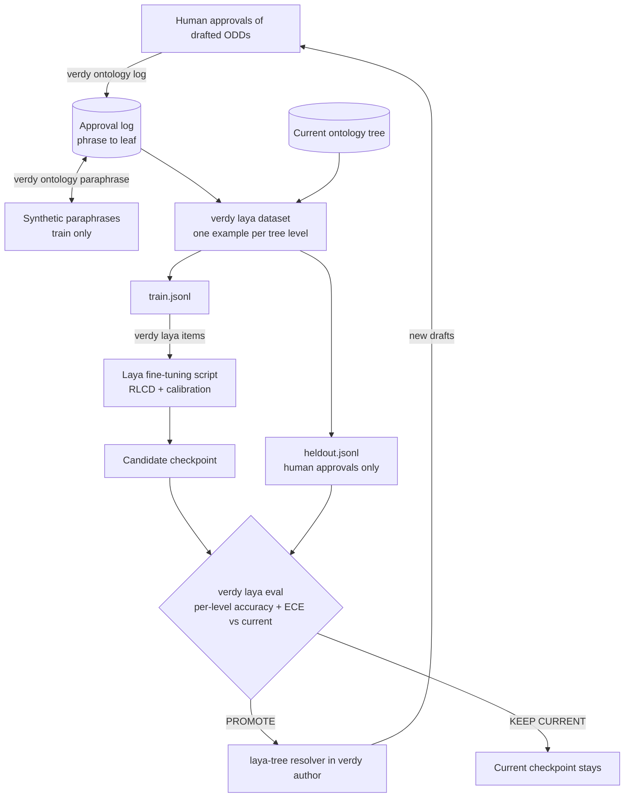

# Fine-tuning Laya on your approvals

The `laya-tree` resolver walks the ontology tree with
[Laya](https://github.com/NandhaKishorM/laya), a local, open-weight decision model. The base
checkpoints are a fast starting point to specialise, not a zero-shot decision engine: Laya's
own benchmarks put them near chance on unfamiliar decisions until they are fine-tuned. This
guide turns your approval history into a fine-tuned, calibrated, version-pinned resolver.

## The loop



Approvals feed the log, the log and the current tree produce per-level data, a candidate
checkpoint is trained and evaluated against the current one, and only a promoted checkpoint
reaches `verdy author`. Its resolutions are approved by humans in turn, which grows the log.

## Is it worth it?

It depends on scale:

| Situation | Recommendation |
| --- | --- |
| Under ~100 ontology entries, one customer | Embeddings plus the LLM are enough (`--resolver exact` or `llm`). Laya adds complexity without much gain. Still log approvals. |
| Hundreds of entries, many domain packs, offline sites, audit requirements | Fine-tuned `laya-tree` pays off: fast, local, calibrated, version-pinned matching. The approval history it learns from is yours alone. |

**Cold start.** For the first few hundred approvals, resolve with `--resolver llm` (or
`exact`), have humans approve, and log every approval. Switch to `laya-tree` only once a
fine-tuned checkpoint beats the current resolver on held-out approvals. This is
distillation, with your approval flow as the teacher.

## How the training data is built

- **The log stores phrase → leaf, not phrase → path.** Per-level examples are regenerated
  from the current tree at export time, so restructuring the ontology never invalidates
  your data.
- **One approval gives one example per level.** A leaf at depth 4 gives four examples, and
  at each level the siblings of the right branch are built-in hard negatives.
- **"None" examples come from approved new entries.** When the entry was approved, the
  correct answer at its parent was "none". The log keeps a snapshot of the options shown
  then, so that example stays correct after the entry joins the tree. From then on, the
  entry's own path is a positive example too.
- **Paraphrases are synthetic.** `verdy ontology paraphrase` has Claude write variants of
  approved phrases ("poor vis", "silty", "milky water"). They are tagged
  `source: synthetic`, used for training only, and never trained on when their source
  phrase is held out. Evaluation uses only real, human-approved phrases.
- **Splits are stable.** A record's side (train or held-out) is a hash of its id, so it
  never moves as the log grows.
- **The question format is shared.** The walker and the dataset build questions with the
  same code (`verdy.odd.levels`), so what Laya is trained on is exactly what it is asked.
  Training rows shuffle option order, `none` included, so the model learns content rather
  than position.

## Requirements

- `pip install -e ".[laya]"` installs Laya, PyTorch and transformers. Use a CPU-only or CUDA
  PyTorch build to suit your machine; see Laya's installation notes.
- Somewhere to train:
  - an Apple Silicon Mac with about 16 GB of memory (Laya's MPS script), or
  - a CUDA GPU, or
  - Kaggle's free 2xT4 (Laya's notebook).
- Network access to Hugging Face, once, for the base checkpoint.
- A Claude API key only for `verdy ontology paraphrase`, which is optional.

## Step by step

### 1. Log approvals (start today)

Each time a human approves a drafted ODD, log it:

```console
$ verdy ontology add odd.yaml --ontology subsea.yaml    # logs, and adds approved new entries
$ verdy ontology log odd.yaml --ontology subsea.yaml    # logs only
Logged 6 new approvals to .verdy/ontology/approvals.jsonl (0 already logged)
```

Logging is idempotent, so re-running it on the same ODD adds nothing. Keep the log under
version control or back it up. It is the asset everything else is rebuilt from.

### 2. Optionally, add paraphrases

```console
$ verdy ontology paraphrase -n 3          # needs pip install -e ".[llm]" and ANTHROPIC_API_KEY
Added 412 synthetic paraphrases to .verdy/ontology/approvals.jsonl
```

### 3. Export the dataset

```console
$ verdy laya dataset --ontology subsea.yaml -o laya_data --holdout 0.2
Wrote laya_data: 1840 training rows, 402 held-out rows from 310 human and 412 synthetic
approvals (subsea@0.3.0).
```

| File | Contents |
| --- | --- |
| `train.jsonl` | One row per (approval, level), in Laya's typed-decisions row format: `state`, `questions` and `gold` as JSON strings, with gold as one-hot `probabilities`. |
| `heldout.jsonl` | Human approvals only, in the `laya-evals` dataset format (`state`, `questions`, `expected`, `tags` such as `level:3` and `kind:none`), with options in the walker's order. |
| `manifest.json` | Row counts by level, kind and source; the ontology and log digests; and approvals skipped because their leaf or group is no longer in the tree. |

### 4. Download the base checkpoint

```console
$ huggingface-cli download convaiinnovations/laya --local-dir laya_base
```

That is the English checkpoint: ModernBERT-large, about 421M parameters. For non-English
phrases, start from the multilingual checkpoint (the `multilingual/` subfolder of the same
repository) and point `--model-dir` at that folder.

### 5. Tokenize the training rows

```console
$ verdy laya items laya_data/train.jsonl --model-dir laya_base -o laya_data/train_items.pt
Wrote 1840 training items to laya_data/train_items.pt (0 skipped).
```

This writes the item format Laya's fine-tuning scripts train on: token ids, option-marker
positions, per-option targets and the gold label. It uses `laya.common.build_sequence` with
the scripts' budgets (`max_len` 1024, `head_max_len` 256). A row is skipped if the
question's options didn't fit the head budget. If that happens, the node has too many
children or glosses that are too long: run `verdy ontology validate`.

### 6. Train with Laya's script

Use the fine-tuning script from the Laya repository, at the release matching your installed
`laya` version. On Apple Silicon or CPU:

```console
$ curl -LO https://raw.githubusercontent.com/NandhaKishorM/laya/main/notebooks/laya_finetune_typed_decisions_mps.py
$ python laya_finetune_typed_decisions_mps.py \
    --model-dir laya_base \
    --items laya_data/train_items.pt \
    --output-dir laya_verdy \
    --epochs 4 --micro-batch 1 --grad-accum 32
```

- The script trains on the items file as is, because `verdy laya items` writes it without
  the script's `.meta.json` cache sidecar. Don't pass `--force-preprocess`: that rebuilds
  the items from Laya's own benchmark dataset instead of yours.
- Training combines Laya's RLCD objective (proper-scoring-rule rewards with a GRPO-style
  policy gradient) with cross-entropy. It then fits one temperature per question type and
  writes the checkpoint to `--output-dir`, saving `checkpoint_latest/` after each epoch.
- The calibration temperatures are fitted on a slice of the training items, not your
  held-out set. Step 7 is what tells you whether the checkpoint is actually calibrated.
- The script labels the result `laya-typed-decisions` in its config. That name is
  cosmetic.
- On CUDA or Kaggle, use Laya's 2xT4 notebook. Upload `train_items.pt` and replace the cell
  that builds items from the benchmark dataset with `torch.load` of your file.

Laya reports about 4 to 5 hours for 4 epochs over about 30,000 questions on 2xT4. Time
scales with the number of items, so a few thousand items should take a fraction of that.
This is an estimate, not a measurement.

### 7. Evaluate, and promote only if it's better

```console
$ verdy laya eval laya_data/heldout.jsonl --checkpoint ./laya_verdy --baseline english -o laya_verdy.eval.json
./laya_verdy: accuracy 0.912, ECE 0.031, Brier 0.071 (n=402)
  level 1: accuracy 0.97, ECE 0.02 (n=124)
  level 2: accuracy 0.93, ECE 0.03 (n=124)
  ...
english: accuracy 0.41, ECE 0.22, Brier 0.48 (n=402)
PROMOTE ./laya_verdy vs english:
  accuracy 0.410 -> 0.912
  ECE 0.220 -> 0.031
```

(The numbers above show the output format, not a measurement.)

A checkpoint is promoted, with exit code 0, only if, on the same held-out human approvals:

- its overall accuracy is higher than the baseline's;
- its accuracy at every tree level drops by no more than `--tolerance` (default 0); and
- its expected calibration error is no higher.

Otherwise the command prints `KEEP CURRENT` with the reasons and exits 1.

Calibration matters as much as accuracy, because the walker multiplies probabilities along
the path and compares the product with `--min-probability`. An overconfident checkpoint
accepts wrong matches.

`--baseline` takes any of:
- a checkpoint name (`english`, `multilingual`, `typed-decisions`);
- a fine-tuned directory;
- a saved report from `-o`.

A saved report only compares if it was made on the same `heldout.jsonl`; the reports record
a digest of the data. After a new export, re-run the current checkpoint rather than reusing
an old report.

`heldout.jsonl` also follows the `laya-evals` dataset format, so Laya's own evaluation
tools can read it.

### 8. Switch the resolver on

```console
$ verdy author "ROV inspection: murky water near the jacket legs, strong current" \
    --ontology subsea.yaml --resolver laya-tree \
    --resolver-option checkpoint=./laya_verdy -o odd.draft.yaml
```

Every resolved parameter records the walk (`resolution.path`), the model and the ontology
version, and the ODD records `metadata.authoring`. Keep promoted checkpoints in versioned
directories (`laya_checkpoints/2026-10-03/`) and never overwrite one in place. To pin
weights by digest, pass Laya's `expected_sha256` through, for example
`--resolver-option 'expected_sha256={model.safetensors: <hex>}'`.

Walker options:

| Option | Default | Description |
| --- | --- | --- |
| `checkpoint` | Laya's router | A fine-tuned directory, a Hub id, or `english` / `multilingual` / `typed-decisions`. |
| `beam_width` | 2 | Most paths kept per level. |
| `beam_margin` | 0.2 | The runner-up branch is kept when within this much of the best. |
| `--min-probability` | 0.5 | Path probability (product of steps) below which a leaf counts as "none". |

### 9. Retrain on a schedule

Retrain every few hundred new approvals, not on every commit:

```console
$ verdy laya due --manifest laya_data/manifest.json --every 300 && ./retrain.sh
362 human approvals, 310 in the last dataset, 52 new: retraining is not due (every 300).
```

`due` exits 0 when retraining is due, so a nightly job can chain steps 3 to 7. Promote the
new checkpoint only when step 7 says `PROMOTE`.

## Keeping the tree trainable

- Run `verdy ontology validate` in CI. Every node needs 15 children or fewer, so that `none`
  fits in Laya's option budget.
- When a node outgrows the limit, `verdy ontology regroup ONTOLOGY -o OUT` has Claude
  propose intermediate groups, which are written as `status: draft`. Have a human approve
  them, then re-export. The log stores phrase → leaf, so nothing is lost.
- Give groups short, distinct definitions. Options are shown as `id: label: ~10 words`.
- Laya can follow boolean-sounding option labels (`yes`, `no`, `true`) instead of their
  descriptions, so keep node ids semantic.

## What has been verified

Verdy's tests cover the following with stand-ins for Laya, the tokenizer and the training
scripts:
- dataset generation;
- splits;
- the item format, mirroring `build_training_item` in Laya's script;
- the walker's beam search;
- evaluation and the promotion gate.

Verdy's CI does not download Laya's weights or run training. Check one real round
(steps 3 to 7) on your own data before relying on it.
