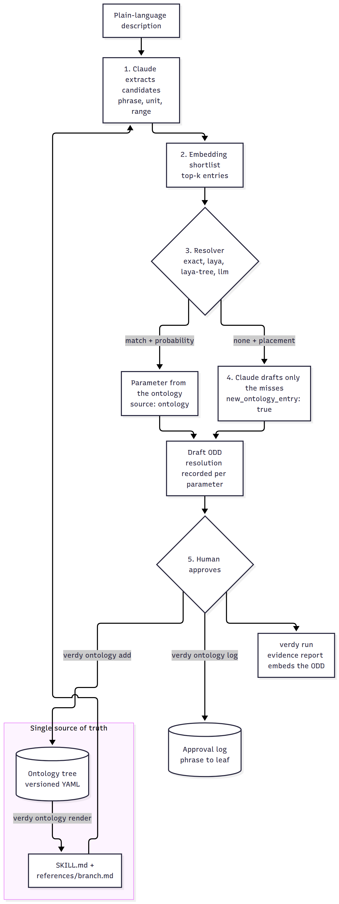

# Ontology and resolvers

`verdy author` doesn't let a language model invent parameter names for things your team
has already defined. It resolves the description against a **parameter ontology**:
canonical names, units, physical bounds, distributions and grounding. Claude only writes
the parameters the ontology doesn't have yet. This gives the same names across ODDs and
customers, and a reusable ontology that grows with every approved ODD. It also cuts LLM
calls.

One file is the source of truth: a versioned, tree-shaped ontology. The LLM reads it as a
rendered skill, Laya walks it level by level, and the training data for Laya is generated
from it.

## Pipeline: LLM → shortlist → resolver → LLM → human

```text
"murky water near the jacket legs, strong current"
   │
   ▼ 1. LLM extracts     candidates with ranges:  water_clarity [5, 50] NTU ("murky water"),
   │                     current [1, 3] knots ("strong current"), leg_spacing [2, 6] m
   ▼ 2. Shortlist        top-k ontology entries per candidate (embeddings, default k = 15)
   ▼ 3. Resolver         turbidity (p = 0.93), current_speed (p = 0.88), none (p = 0.81)
   ▼ 4. LLM authors      definitions only for the misses → jacket_leg_spacing,
   │                     flagged new_ontology_entry
   ▼ 5. Human approves   provenance.approved: true, as for every drafted parameter
```

The same flow as a diagram, including the loop back into the ontology and the approval
log. Miss authoring also gets the reference files of the branches its misses fall in, and
the log is what the Laya walker is fine-tuned on ([Laya fine-tuning](laya-finetuning.md)):

<p align="center"></p>

1. **Extract.** Claude turns the description into candidate parameters, each with the
   phrase that mentions it, a type, a unit and a range. A classifier can't do this, because
   it has to generate. Claude gets the ontology's rendered `SKILL.md` (naming conventions,
   units, top-level branches), so it doesn't invent near-duplicates such as `water_clarity`
   next to `turbidity`.
2. **Shortlist.** An embedder ranks the ontology entries against each candidate and keeps
   the top `k`. An exact name or synonym hit always ranks first.
3. **Resolve.** A resolver picks the matching entry or `none`, with a probability. A match
   below `--min-probability` (default 0.5) counts as `none`, and the rejected choice is
   recorded as `proposed`.
4. **Author misses.** Claude drafts full definitions (description, range, distribution) only
   for candidates resolved to `none`. If there are no misses, it makes no call. It gets the
   reference file of each branch its misses fall in, and the group to place each one under:
   the `laya-tree` resolver's "none" location, or Claude's own choice. The group is recorded
   as `provenance.ontology_parent`.
5. **Approve.** Every drafted parameter starts with `approved: false`, so `verdy validate
   --strict` fails until a human reviews it.

Matched parameters take the entry's name, description, unit, distribution and grounding.
The range is the candidate's own range, clipped to the entry's physical bounds. If the units
differ ("knots" against `m/s`), Verdy keeps the entry's bounds and adds a `note` asking for
a converted, narrower range. Verdy doesn't convert units itself. Constraints the
extraction wrote are renamed to the resolved names. A constraint that names a parameter
that was dropped is removed and listed in `metadata.authoring.dropped_constraints`.

## Resolvers

| Resolver | How it decides | Needs |
| --- | --- | --- |
| `exact` (default) | Normalised string match of the candidate's name or phrase against entry names and synonyms. Probability 1.0 on a hit. | Nothing |
| `laya` | [Laya](https://github.com/NandhaKishorM/laya), an open-weight non-autoregressive decision model, runs locally. It answers one typed `choice` question per candidate, whose options are the shortlist plus `none`. The probability is Laya's probability for its choice. | `pip install "verdy[laya]"` (pulls in PyTorch; Laya downloads its weights from Hugging Face on first use). No API key. |
| `laya-tree` | Laya walks the tree from the roots: at each level, one `choice` among the node's children plus `none`. See [the tree walker](#the-laya-tree-walker). | `pip install "verdy[laya]"`, and in practice a checkpoint fine-tuned on your approvals ([Laya fine-tuning](laya-finetuning.md)) |
| `llm` | Claude resolves all candidates in one structured-output call, giving a probability and a reason for each. | `pip install "verdy[llm]"` and the `ANTHROPIC_API_KEY` secret |
| `module:attribute` | Your own subclass of `verdy.odd.resolve.Resolver`, or a factory for one | Your code |

```console
$ verdy author "ROV inspection: murky water near the jacket legs, strong current" \
    --resolver laya -o odd.draft.yaml
Draft ODD with 3 parameters written to odd.draft.yaml.
Resolved against core@0.2.0 with the laya resolver: 2 matched, 1 new.
  'murky water'                    -> turbidity  (p=0.93)
  'strong current'                 -> current_speed  (p=0.88)
  'close jacket legs'              -> jacket_leg_spacing  NEW ONTOLOGY ENTRY (p=0.81)
Review every parameter, then set provenance.approved: true on the ones you accept.
```

| `verdy author` option | Default | Description |
| --- | --- | --- |
| `--ontology NAME\|FILE` | `core` | Bundled ontology or a file. `none` turns resolution off: Claude writes every parameter, as in Verdy 0.5. |
| `--resolver` | `exact` | `exact`, `laya`, `laya-tree`, `llm` or `module:attribute`. |
| `--resolver-option KEY=VALUE` | | Passed to the resolver; repeatable. For Laya: `checkpoint=english\|multilingual` or, for `laya-tree`, a fine-tuned directory (`checkpoint=./laya_verdy`); `beam_width=2`, `beam_margin=0.2`. |
| `--min-probability` | `0.5` | A match below this counts as `none`. |
| `--embedder` | `hashing` | `hashing` (local, no dependencies, lexical) or `sentence-transformers[:MODEL]` (local, semantic; `pip install sentence-transformers`). |
| `--top-k` | `15` | Shortlist size. |

The hashing embedder finds shared words and spelling ("strong current" → `current_speed`).
It doesn't find meaning: "murky" resolves to `turbidity` only because "murky water" is a
synonym of that entry. For paraphrases that share no words, use a sentence embedder and
`laya` or `llm`.

## Provenance: why "murky" became `turbidity`

Each parameter records its resolution, and evidence reports embed the ODD, so this record
is part of the sealed evidence:

```yaml
- name: turbidity
  description: Suspended particles in water that reduce optical visibility.
  category: environment
  type: continuous
  unit: NTU
  range: [5.0, 50.0]
  distribution: loguniform
  provenance:
    source: ontology
    confidence: 0.93
    approved: false
    resolution:
      resolver: laya
      model: laya:english
      decision: turbidity
      probability: 0.93
      candidate: water_clarity
      phrase: murky water
      ontology: core@0.2.0
      embedder: hashing
      shortlist:
        - {entry: turbidity, score: 1.0}
        - {entry: current_speed, score: 0.21}
        # ... top 5
```

A miss records `decision: none` and has `source: llm`, `new_ontology_entry: true` and
`ontology_parent`. With `laya-tree`, `resolution.path` lists the node and probability chosen
at each level, and a miss has `resolution.placement`. If two phrases resolve to the same
entry, the parameter appears once and lists the second phrase under `also_mentioned_as`.
`metadata.authoring` in the ODD records the ontology, resolver, embedder, match counts and
`skill_sha256`, the digest of the rendered skill the LLM was given. See the
[ODD spec](odd-spec.md#provenance-and-llm-authoring).

## Ontology files: a tree

```yaml
name: subsea
version: 0.3.0
max_children: 15                   # optional; the default
nodes:
  - id: environment                # roots are ODD categories
    label: Environment
    definition: The world around the robot.
  - id: water
    parent: environment
    label: Water
    definition: Conditions of water the robot works in or near.
  - id: water_optical
    parent: water
    label: Optical
    definition: How well light travels through the water.
  - id: turbidity                  # a node with a type is a leaf: an ODD parameter
    parent: water_optical
    label: Turbidity
    definition: Suspended particles in water that reduce optical visibility.
    aliases: [murky water, water clarity, silt]
    type: continuous               # continuous | temporal | categorical | boolean
    unit: NTU
    range: [0.1, 1000]             # physical bounds; ODDs narrow them
    distribution: loguniform
    grounding: {sim: water_turbidity, runtime: /sensors/turbidity/ntu}
    status: approved               # or draft
```

Every node has an id, a label, a one-line definition, aliases, a parent and a status.
Leaves also have a type, unit, physical bounds, distribution and grounding (the simulator
parameter and runtime signal). Ids are unique across the tree, `none` is reserved, and a
leaf's ODD category is its root. Flat ontologies from Verdy 0.6 (`entries` with a
`category`) still load, with each entry as a leaf under its category.

**The structural rule:** every node has at most `max_children` children (default 15). Laya
scores a level's options within one token budget and works best with about 20 options or
fewer, so 15 leaves room for `none`. When a node outgrows the limit, add an intermediate
group (for example, split `water` into `water_optical`, `water_motion` and `water_site`) and
have a human approve it.

Claude can propose those groups:

```console
$ verdy ontology regroup subsea.yaml -o subsea.regrouped.yaml   # every node over the limit
$ verdy ontology regroup subsea.yaml water -o subsea.regrouped.yaml
water: 3 new draft groups (5 children now)
  + water_optical (Optical): turbidity, light_attenuation, secchi_depth, ...
  + water_motion (Motion): current_speed, wave_height, swell_period, ...
  + water_chemistry (Chemistry): salinity, dissolved_oxygen, ph
  why: ...
Wrote subsea.regrouped.yaml. Review the groups marked status: draft, ...
```

Claude groups the children by what the quantities physically are, gives each new group a
snake_case id, a label and a one-line definition, and puts each child in at most one group.
Verdy checks the proposal and sends any problems back to Claude for a retry. A proposal is
rejected if:
- a new group's id is taken or isn't snake_case;
- a child belongs to two groups;
- a group has fewer than 2 or more than 15 children;
- the node would still be over the limit.

The new groups are written as `status: draft`, with their members moved under them, into the
output file (or in place with no `-o`). Review the diff, edit or delete groups, and set
`status: approved`, then re-render the skill. `validate` lists draft nodes until then.
Regrouping doesn't invalidate the approval log: it stores phrase → leaf, and Laya training
examples are regenerated from the new tree.

```console
$ verdy ontology validate subsea.yaml       # exits 1 on any error, for CI
subsea.yaml: error: water: 17 children, limit 15; add an intermediate group so Laya keeps
room for 'none' among its options
$ verdy ontology list subsea.yaml           # the tree
$ verdy schema ontology                     # the JSON Schema
```

The bundled `core` ontology has 31 parameters in 18 groups covering light, weather, water,
terrain, space, people, platform, task, sensors and faults.

## The rendered skill

`verdy ontology render ONTOLOGY -o DIR` renders the ontology as an LLM skill:

- **`SKILL.md`**: naming conventions, unit rules, how to write distributions and grounding,
  the top-level branches with one-line descriptions, and worked examples.
- **`references/<branch>.md`**: the full subtree of one top-level branch.

Nobody edits these files by hand, so they can't drift. CI re-renders them on every commit
and fails if the committed copy is stale (`verdy ontology render core -o
skills/ontology-core --check`). The bundled ontology's skill is in
[`skills/ontology-core/`](../skills/ontology-core/SKILL.md); copy a rendered skill into
`.claude/skills/` to use it in Claude Code.

`verdy author` renders the skill in memory. It sends `SKILL.md` with the extraction request,
and only the references for the branches its misses fall in with the miss-authoring
request. It records the skill's digest in `metadata.authoring.skill_sha256`, so the evidence
report pins exactly what the LLM was told.

The skill is cheap and helps right away. It mainly stops the LLM from creating
near-duplicates and keeps new entries consistent.

## The Laya tree walker

The `laya-tree` resolver descends the tree instead of choosing among a flat shortlist. At
each level it asks Laya one question: which of this node's children (each shown as its id
with a gloss of about ten words, because options share Laya's head token budget) contains
the quantity, or `none`.

- **Beam, not greedy descent.** When the runner-up branch is within `beam_margin` (0.2) of
  the best, it is kept too, up to `beam_width` (2) paths. One early mistake therefore doesn't
  send the match down the wrong subtree. All of a level's questions go to Laya in one call.
- **The probability is the product along the path.** That product is what
  `--min-probability` is compared against.
- **"None" is informative.** If Laya picks `water → water_optical` and then `none`, a new
  entry is needed and it belongs under `water_optical`. This placement goes to the
  miss-authoring step, so Claude drafts the entry in the right place.

The base Laya checkpoints are near chance on unfamiliar decisions without fine-tuning, so
treat the walker as something to specialise on your own approvals. See
[Laya fine-tuning](laya-finetuning.md), which also covers when to switch it on.

## Growing the ontology, and the approval log

After review, log the approvals and move the approved new parameters into your ontology:

```console
$ verdy ontology add odd.yaml --ontology subsea.yaml     # updates subsea.yaml in place
Logged 3 new approvals to .verdy/ontology/approvals.jsonl (0 already logged)
Added 1 entries to subsea.yaml: jacket_leg_spacing (under task)
$ verdy ontology add odd.yaml --ontology core -o subsea.yaml
$ verdy ontology log odd.yaml --ontology subsea.yaml      # log only (no new entries)
$ verdy ontology render subsea.yaml -o .claude/skills/ontology-subsea
```

`add` adds only parameters marked `new_ontology_entry` that a human has approved. It places
each one under its `ontology_parent` and keeps the phrases that mentioned it as aliases. The
next ODD that mentions "close jacket legs" then resolves to `jacket_leg_spacing` with no LLM
authoring.

Both commands append to the **approval log** (`.verdy/ontology/approvals.jsonl`). Each line
records one approved resolution as **phrase → leaf**, with the extraction context, the
resolver's original decision (so corrections are visible), and for new entries the group and
a snapshot of the options shown there. Start logging now, whichever resolver you use. The
log is an audit trail of how wording maps to parameters, and it becomes the training data
for the Laya walker.

## Python API

```python
from verdy.odd.authoring import draft_odd
from verdy.odd.resolve import LayaResolver

odd = draft_odd(description, ontology="subsea.yaml",
                resolver=LayaResolver(min_probability=0.6, checkpoint="english"),
                embedder="sentence-transformers:all-MiniLM-L6-v2", top_k=20)
```

`draft_odd(..., resolver=LayaTreeResolver(checkpoint="./laya_verdy", beam_width=2))` uses
the walker. To write a plug-in, implement `resolve(candidate, options, context) -> Resolution` and
return `self._decide(candidate, options, label_or_None, probability, reason)`. Override
`resolve_all` to batch.
