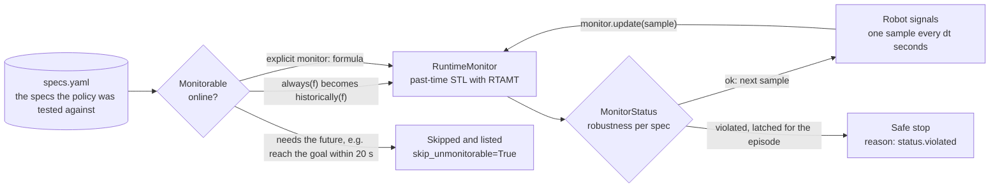

# Runtime monitors

The specs a policy is tested against can also run on the robot, flagging violations as
they happen. `verdy.monitor.RuntimeMonitor` evaluates specs online with RTAMT.



```python
from verdy.metrics import load_specs
from verdy.monitor import RuntimeMonitor

monitor = RuntimeMonitor(load_specs("specs.yaml"), dt=0.1, skip_unmonitorable=True)

for sample in robot_stream():                 # e.g. {"dist_obstacle": 0.8, "speed": 0.4}
    status = monitor.update(sample)
    if not status.ok:
        robot.safe_stop(reason=status.violated)
```

`update` returns a `MonitorStatus` with the current robustness of each monitored spec,
`ok` and the names of `violated` specs.

## Past-time formulas

A monitor running on the robot cannot see the future, so it needs past-time formulas:
`historically` instead of `always`, `once` instead of `eventually`.

* A spec written as `always(<formula without temporal operators>)` is converted to
  `historically(...)` automatically.
* Any other spec needs an explicit `monitor` formula in the specs file:

  ```yaml
  - name: stop_after_bump
    formula: always((bumper > 0) implies eventually[0:1](speed <= 0.01))
    monitor: historically((once[1:1](bumper > 0)) implies (speed <= 0.01))
  ```

* With `skip_unmonitorable=True`, specs that cannot be monitored (such as "reach the goal
  within 20 s") are skipped and listed in `monitor.skipped`; otherwise they raise
  `SpecError`.

`historically` latches: once violated, the spec stays violated for the rest of the
monitored episode. Create a new monitor per episode.

## Sampling rate

Feed samples at the fixed rate `dt` (seconds). The monitor counts samples, so time bounds
in formulas are interpreted as `dt` seconds per sample. Every sample must contain every
signal the monitored specs use.
