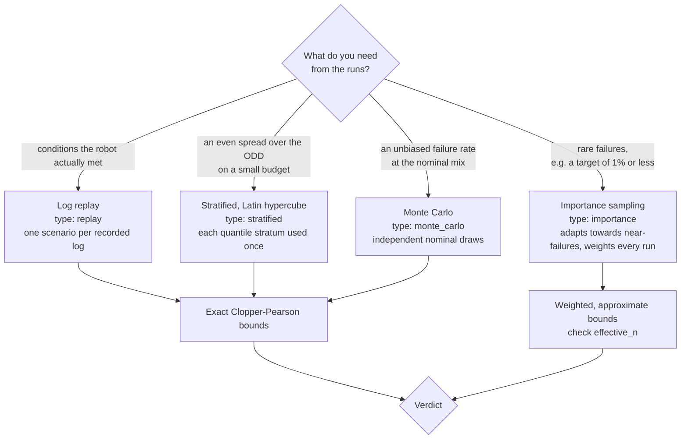
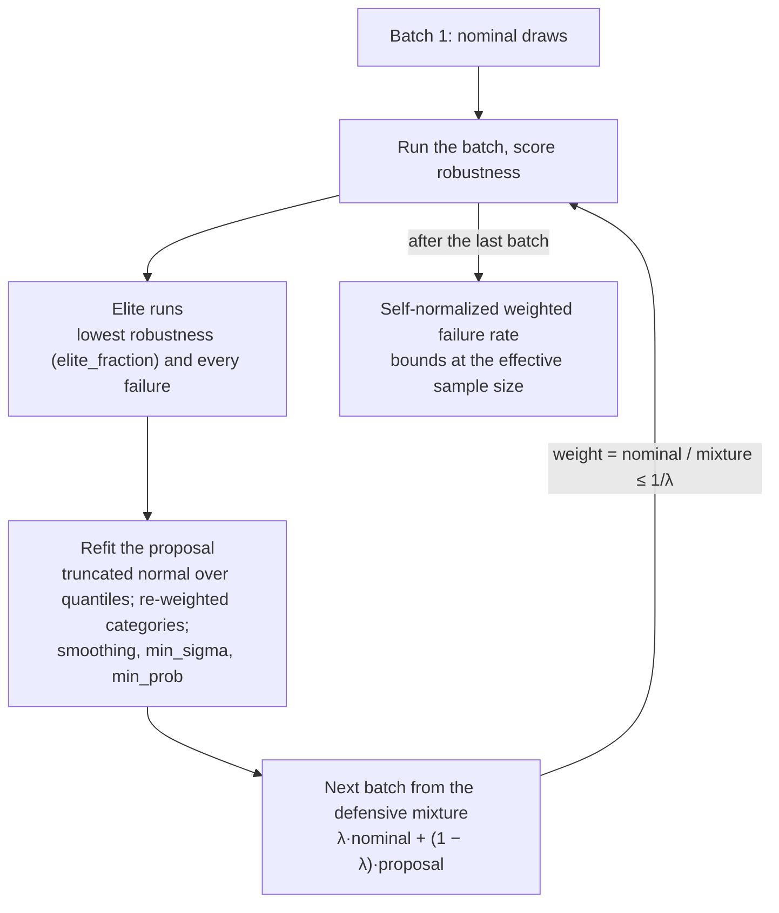

# Scenario sampling

A sampler turns the ODD into concrete scenarios: one value per parameter, plus a random
seed for the rollout. Every sampler is deterministic given its seed, and every scenario
satisfies the ODD [constraints](odd-spec.md#constraints).

| Sampler | Config `type` | Use it to |
| --- | --- | --- |
| `MonteCarloSampler` | `monte_carlo` | Draw independent scenarios from the nominal distribution. |
| `StratifiedSampler` | `stratified` | Cover the domain evenly with a small budget (Latin hypercube). |
| `ImportanceSampler` | `importance` | Hunt for rare failures while keeping estimates unbiased. |
| `LogReplaySampler` | `replay` | Take scenarios from recorded logs. |

Preview scenarios with `verdy sample odd.yaml -n 10 --sampler stratified`.

## Choosing a sampler



## Monte Carlo

Independent draws from each parameter's nominal distribution, rejecting any that violate
a constraint. Failure-rate estimates use exact Clopper-Pearson bounds.

## Stratified (Latin hypercube)

For a batch of `n` scenarios, each parameter's quantile range is split into `n`
equal-probability strata, and each stratum is used exactly once. Marginal distributions
still follow the nominal ODD, so estimates stay unbiased, but small budgets cover the
domain far more evenly than independent draws. A point that violates a constraint is
replaced with a random feasible draw and marked `metadata.stratified: false`.

## Importance sampling (cross-entropy)

Failures you care about are often rare: at a true failure rate of 0.1%, a thousand random
runs show about one failure. `ImportanceSampler` adapts its proposal towards scenarios that
come close to failing, and weights every run so the failure probability is still estimated
under the nominal ODD.

How it works:



1. The first batch is drawn from the nominal distribution.
2. After each batch, the lowest-robustness runs (`elite_fraction`, and always every
   failure) are used to refit the proposal. Numeric parameters are fitted with a truncated
   normal over their nominal quantile `u = F(x)`, which works for any nominal shape;
   categorical and boolean parameters get re-weighted probabilities. `smoothing` blends
   each fit with the previous proposal, and `min_sigma` / `min_prob` keep it from
   collapsing.
3. Scenarios come from a defensive mixture `λ·nominal + (1 − λ)·proposal`
   (`defensive = λ`), with weight `nominal(x) / mixture(x) ≤ 1/λ`.
4. The failure probability is the self-normalized weighted failure rate.

```yaml
sampler:
  type: importance
  options: {elite_fraction: 0.2, defensive: 0.3, smoothing: 0.7, min_sigma: 0.05}
batch_size: 100   # the proposal is refit after every batch
```

**Limitations.** Importance-sampling bounds are approximate: Verdy reports the wider of a
normal interval and Clopper-Pearson bounds at the effective sample size (`effective_n` in
the report). How much importance sampling helps depends on how well robustness predicts
failure. On the home-robot example it found about twice as many collisions as Monte Carlo
for the same budget, with estimates that agree with a large Monte Carlo baseline. Check the
effective sample size: if it is small compared with the number of runs, the weights are
degenerate and the bounds should not be trusted.

## Log replay

`LogReplaySampler(odd, logs_dir)` yields one scenario per `*.json` log in sorted order,
taking parameter values from the log's `params`. Use it with the
[replay backend](backends.md#log-replay). Recorded logs show the conditions your robot has
actually met, so coverage reports often reveal gaps in the field data.

## Writing a sampler

Subclass `verdy.sampler.Sampler` and implement `sample(n)`. Use `self.rng` for randomness,
`self._draw_nominal()` for constrained nominal draws, and `self._make(params, weight)` to
create scenarios with ids and seeds. Set `adaptive = True` and implement
`update(scenarios, scores)` if the sampler learns from results.
