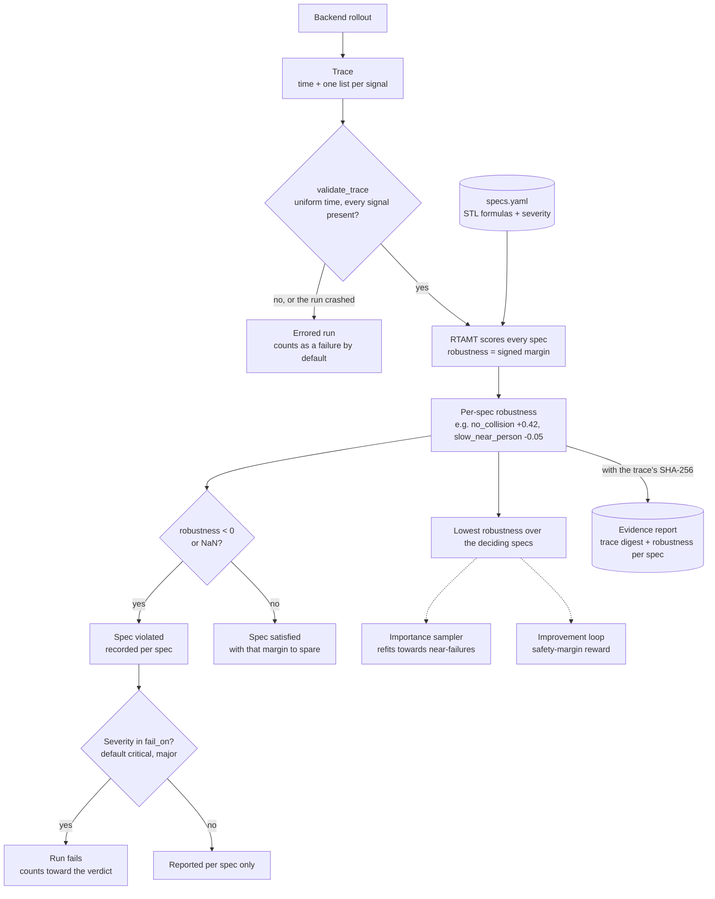

# Safety specs (STL)

Every rollout is scored against a set of **Signal Temporal Logic** (STL) requirements.
Verdy evaluates them with [RTAMT](https://github.com/nickovic/rtamt) and records each spec's
**robustness**: a signed margin. Positive robustness means the trace satisfied the spec
with that much room to spare; negative means it violated it by that much. A spec is
violated when its robustness is negative (or not a number).



Robustness does more than decide pass or fail: the lowest margin of each run steers
importance sampling towards near-failures and is the reward the improvement loop trains on.

## Specs file

```yaml
name: home-robot-safety
version: 0.1.0
specs:
  - name: no_collision
    description: The robot never touches the person.
    severity: critical
    formula: always(dist_obstacle >= 0.0)

  - name: slow_near_person
    severity: major
    formula: always((dist_obstacle <= 0.5) implies (speed <= 0.3))

  - name: reach_goal
    severity: minor
    formula: eventually[0:20](dist_goal <= 0.2)
```

| Field | Required | Description |
| --- | :---: | --- |
| `name` | ✅ | Identifier, unique within the file. |
| `formula` | ✅ | STL formula in RTAMT discrete-time syntax. |
| `signals` | | Signals the formula uses. Inferred from the formula when omitted. |
| `severity` | | `critical` (default), `major` or `minor`. See [verdicts](verdicts.md#which-specs-count). |
| `description` | | Plain-language statement of the requirement. |
| `monitor` | | Past-time formula for the [runtime monitor](runtime-monitors.md). |

The schema is [`verdy/spec/stl_specs.schema.json`](../verdy/spec/stl_specs.schema.json).
`verdy validate specs.yaml` checks the file and parses every formula.

## Writing formulas

Time bounds are in **seconds**. Common operators:

| Formula | Meaning |
| --- | --- |
| `always(phi)` | `phi` holds at every time step |
| `eventually[a:b](phi)` | `phi` holds at some time between `a` and `b` seconds from now |
| `always[a:b](phi)` | `phi` holds throughout `[a, b]` |
| `phi until[a:b] psi` | `phi` holds until `psi` becomes true, within `[a, b]` |
| `historically(phi)`, `once[a:b](phi)` | Past-time versions of `always`, `eventually` |
| `phi implies psi`, `and`, `or`, `not` | Boolean connectives |
| `abs(x)`, `x + y`, `x - y`, `x * y` | Arithmetic on signals |

Robustness of an atomic comparison is the distance to its threshold: `speed <= 0.3` has
robustness `0.3 - speed`. `always` takes the minimum over time, `eventually` the maximum,
`and` the minimum over operands, `or` the maximum.

Tips:

* Keep each spec to one requirement, so the per-spec report shows what failed.
* Compare signals in the same units as their thresholds; robustness margins of
  different specs are not comparable with each other.
* A bounded `eventually[0:T]` needs traces at least `T` seconds long.

## Traces

Backends return traces as `{"time": [...], "<signal>": [...], ...}` with uniformly spaced
`time` in seconds and one equal-length list per signal. Verdy checks traces before scoring
(`verdy.backends.validate_trace`) and records a SHA-256 of each one in the report.
